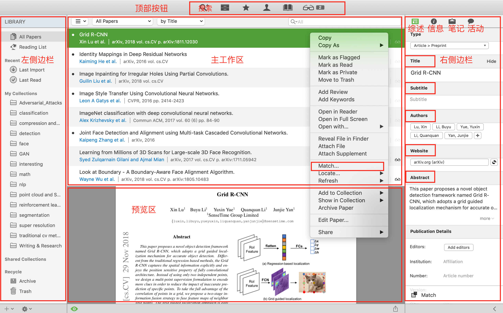

### 1. Papers： Your personal library of reasearch

> Papers helps you collect and curate the research material that you're passionate about. This award winning reference manager will improve the way you **find**, **organize**, **read**, **cite** and **share**.

相关的软件： Mendely、Papers、EndNote、RefWorks、Zotero

### 2. Download Papers

**Address：**https://www.papersapp.com

### 3. Getting Started

#####（1）顶部按钮： Search、Library、Labels、Authors、Sources、Readers

**右侧边栏**：
**综述**：可以在这个界面添加关于文献的关键词，评论和各种标签。

**信息**：包括作者等各种出版时的信息，这些信息会在导入文献时自动添加。

**笔记**：阅读时添加的笔记

**活动**：一些相关论文和评价

##### （2）导入论文：

Papers 提供了两种添加文献的方式：在线搜索或者本地导入

在线搜索：通过内置的搜索引擎进行在线搜索，搜索出的文献可以直接 import 到个人Library， 同时也会保存在本地。

- 可以通过搜索题目，作者，摘要等内容中的关键词来查找文献

  **all**: All fields     **ti**:  Title           **ab**:  Abstract           **au**:  Author
  **1au**: First Author        **lastau**: Last Author
  **so**:  Source (journal)      **pb**:  Publisher      **ed**:  Editor
  **vol**: Volume      **nr**:  Issue         **pg**:  Pages
  **yr**:  Year       **kw**:  Keyword          **id**:  Identifier

  【输入内容之后，选择相应的标签】

- 提供各种联结词（*AND*，*OR*）来辅助搜索

- 可以通过  *search engines* 中   *favorites*   旁边的 *edit* 按钮编辑搜索引擎

#####（3）Match

在论文上右击，选择 *Match…* ， 会与远程进行同步，自动填充上关键字，摘要，作者等信息。

#####（4）文献的阅读和标记

- 论文的组织：可以通过 **作者**、**关键词**、**文件夹**、**颜色标记**、**Flaged**、**加星** 进行分类。也可以据此查找

- 论文的合并：菜单栏 View --> Show Duplicates --> 选中想要合并的论文 --> 右侧边栏单击 MergePaper 进行合并 

#####（5）论文的阅读：

- **标记**：
  **添加Note**：点击可以向文章选定位置添加笔记，若无选定位置，将在文章当前页添加笔记；
  **高亮**：点击之后，该按钮将处在激活状态（变蓝），然后选中内容时，选中的内容将被高亮显示

  **下划线**：与高亮模式类似，选中的内容将被添加下划线。
  **删除线**：与高亮模式类似，选中的内容将被添加删除线

- **显示**：单页、单页连续、双页、双页连续

- 指定 PDF 阅读器：**Papers** -> **Preferences ** -> **Papers** -> **Open PDF Files** --> **In other application**

#####（6）文献引用

- 在papers 进行基本的设置：引用格式和快捷键
- 在文档中使用快捷键调出搜索框，输入论文内容并选择论文，然后再选择 **copy to clipboard**， 最后粘贴在指定位置即可。

**参考资料：**http://haohailong.net/mac-app-papers/

