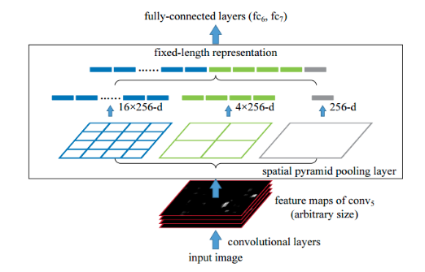
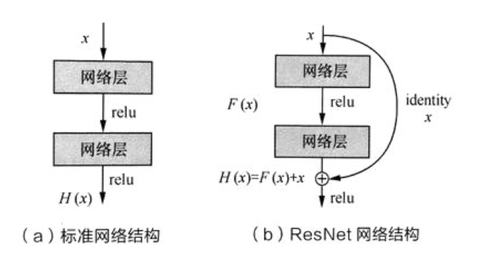
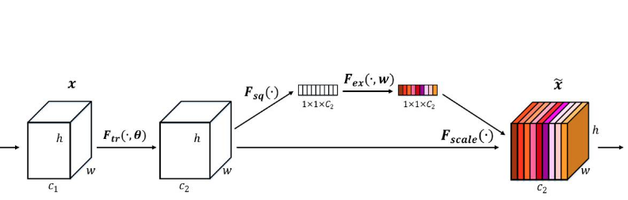

#### 1. 卷积的主要作用是稀疏交互和权值共享，解释两者的特性以及作用? :v:

（１）在卷积神经网络中，卷积核尺度远远小于输入的维度，这样每个输出神经元仅与前一层特定局部区域内的神经元存在连接权重．稀疏交互能够显著减少参数的数量，从而较好的改善过拟合情况。稀疏交互的物理意义在于， 通常图像，文本，语音等现实世界中的数据都具有局部的特征结构，我们可以先学习局部特征，再将局部特征组合起来形成更复杂和抽象的特征。
（２）参数共享: 在卷积神经网络中，卷积核中的每一个元素都将作用于每一次局部输入的特定位置上。根据参数共享的思想，我们只需要学习一组参数集合，而不需要针对每个位置的每个参数都进行优化.参数共享的物理意义在于使得参数具有平移等变性.

- 1x1卷积作用?  (1) 跨通道组织信息，并增加非线性(利用后接的非线性激活函数)．(2)升维和降维

- 转置卷积(逆卷积):　**逆卷积相对于卷积在神经网络结构的正向和反向传播中做相反的运算。逆卷积(Deconvolution)比较容易引起误会，转置卷积(Transposed Convolution)是一个更为合适的叫法．**

  

- 空洞卷积:  带有洞的卷积，**空洞卷积的好处是不做pooling损失信息的情况下，加大了感受野，让每个卷积输出都包含较大范围的信息。**
  

#### 2. 池化层的作用以及不同常见的池化操作? (mean pooling 以及 max pooling的反向传播):v:
常见的池化操作主要针对非重叠区域，包括均值池化、最大池化等。此外，特殊的池化方式还包括相邻重叠区域的池化(over-lapping)以及空间金字塔池化。

- 均值池化是通过对领域内特征数值求平均来实现，能够抑制由于领域大小受限造成估计值方差增大的现象，特点是对背景的保留效果更好。
- 最大池化则是通过取领域内特征的最大值来来实现，能够抑制网络参数误差造成估计均值偏移的现象，特点是更好地提取纹理信息。
- 重叠区域池化是采用比窗口宽度更小的步长，使得窗口在每次滑动时存在重叠区域。
- **空间金字塔池化主要考虑了多尺度信息的描述，例如同时计算1x1，2x2，4x4 的矩阵的池化并将结果拼接在一起作为下一网络层的输入**。
  

池化的**本质**是降采样，从而显著降低参数量，此外还能够保持对平移，伸缩，旋转操作的不变性。

无论max pooling还是mean pooling，都没有需要学习的参数。因此，在卷积神经网络的训练中，**Pooling层需要做的仅仅是将误差项传递到上一层，而没有梯度的计算**。

- max pooling层：对于max pooling，下一层的误差项的值会原封不动的传递到上一层对应区块中的最大值所对应的神经元，而其他神经元的误差项的值都是0；

- mean pooling层：对于mean pooling，下一层的误差项的值会平均分配到上一层对应区块中的所有神经元。

#### 3. 输入输出的计算，参数量的计算，感受野的计算   :v:

要时刻记住的是:　**输入通道数＝卷积核的通道数**　　**输出通道数＝卷积核的个数**

假设输入为　$W_1 * H_1 * D$， 卷积核个数为 $K$，尺寸为$F$，步长为 $S$，

（１）关于输入和输出的计算:
$$
W_2=(W_1−F+2P)/S+1  \\
H_2=(H_1−F+2P)/S+1 \\
$$
（２）参数量为:  $F*F*D*K$

（３）感受野的计算:  假设 $s_0=1$，初始的感受野 $r_0$ 也为1。

- 对于卷积和池化执行如下操作:

$$
r_{l+1}=r_{l}+(k−1)∗s_{l}　\\
s_{l+1}=s_l∗s \\
$$

- 经过多分支的路径，按照感受野最大支路计算。
- 不会改变感受野的情况: conv1x1 s1、ReLU、BN、dropout、shotcut等元素级操作。
- 经过FC层和Gobal Ave Pooling 层，感受野就是整个输入图像。

~~~shell
， convnet =  [[11，4，0]， [3，2，0]， [5，1，2]， [3，2，0]， [3，1，1]　# [kernel_size， stride， padding]
layer_names = ['conv1'，'pool1'，'conv2'，'pool2'，'conv3']
conv1: receptive size: 11  # 1 + (11-1) * 1 = 11， s1 = 1 * 4 = 4
pool1: receptive size: 19  # 11 + (3-1) * 4 = 19， s2 = 4 * 2 = 8
conv2: receptive size: 51  # 19 + (5-1) * 8 = 51， s3 = 8 * 1 = 8 
pool2: receptive size: 67  # 51 + (3-1) * 8 = 67， s4 = 8 * 2 = 16
conv3: receptive size: 99  # 67 + (3-1) * 16 = 99， s5 = 16 * 1 = 16
~~~

#### 4. 反向传播的推导

#### 5. 常见的分类网络及其要点 :v:

- **Alexnet**

（1） 成功**使用ReLU作为CNN 的激活函数**，并验证其效果在较深的网络超过 Sigmoid， 成功解决了Sigmoid在网络较深时的梯度弥散问题。

（2） 训练时**使用Dropout随机忽略一部分神经元，以避免过拟合**。

（3）在CNN中**使用重叠的最大池化**。此前CNN 中普遍采用平均池化，AlexNet 全部使用最大池化，避免平均池化的模糊化效果。并且 AlexNet 中提出让步长比池化核的尺寸小，这样池化层的输出之间有重叠和覆盖，提高了特征的丰富性。

（4）提出**LRN层，对局部神经元的活动创建竞争机制**，使得其中响应比较大的值变得相对更大，并抑制其他反馈较小的神经元，增强模型的泛化能力。

（5） **使用CUDA加速深度卷积网络的训练**，利用GPU强大的并行能力，处理神经网络训练时大量的矩阵运算。

（6）**数据增强**，随机地从 256 x 256 的原始图像中截取 224 x 224 大小的区域（以及水平翻转的镜像）相当于增加了(256-224)^2 * 2 = 2048 倍的数据量。大大减轻了模型过拟合，提升泛化能力。同时 AlexNet 论文中提到了会对图像的RGB 数据进行PCA 处理，并对主成分做一个标准差为0.1的高斯扰动， 增加一些噪声。

- **VGG**

**VGGNet探索了卷积神经网络的深度与其性能之间的关系，通过反复堆叠3x3的小型卷积核和2x2 的最大池化层， VGGnet成功构筑了16~19层深的卷积神经网络**。**通过将多个卷积层堆叠在一起，可以减少参数数目的同时增加卷积层的非线性变换，使得CNN 对特征的学习能力更强**。

- **Google Inception Net**

（1）**精心设计了 Inception Module提高参数的利用效率，其结构如下所示，Inception Module中包含3种不同尺寸的卷积核1个最大池化，增加了网络对不同尺度的适应性**。

第一个分支对输入进行 1x1卷积，**1x1卷积可以跨通道组织信息，提高网络的表达能力，同时可以对输出通道升维和降维**。

第二个分支先使用了 1x1 卷积，然后连接 3x3 卷积，相当于进行两次特征变换。

第三个分支和第二个分支类似，先是使用了1x1 的卷积，然后连接 5x5 的卷积。

最后一个分支则是3x3 最大池化后直接使用1x1卷积。

Inception Module 的4个分支在最后通过一个聚合操作合并（再输出通道这个维度上聚合）

（2） **去除了最后的全连接层，用全局平均池化层来取代它**。

- **ResNet**

​        ResNet 通过调整网络结构来解决梯度消失问题（反向传播时，梯度将涉及多层参数的交叉相乘，可能会在离输入近的网络层中产生梯度消失的现象）。首先考虑两层神经网络的简单叠加，这时 $$x$$ 经过两个网络层的变换得到 $$H(x)$$ ， 激活函数采用  $$ReLU$$， 如下图$$(a)$$所示。既然离输入近的神经网络层较难训练，那么我们可以将它短接到更靠近输出的层，如下图$$(b)$$所示。输入 $$x$$ 经过两个神经网络变换得到 $$F(x)$$，同时也短接到两层之后，最后这个包含两层的神经网络模块输出 $$H(x) = F(x) + x$$。这样一来， $$F(x)$$ 被设计为只需要拟合输入$$x$$ 与目标输入$$\tilde{H}(x)$$的残差$$\tilde{H}(x)-x$$ ， 残差网络的名称也因此而来。**如果某一层的输出已经较好的拟合了期望结果，那么多加入一层也不会使得模型变得更差，因为该层的输出将直接短接到两层之后，相当于直接学习了一个恒等映射，而跳过的两层只需要拟合上层输出和目标之间的残差即可。**

- **SENet**

  采用了一种全新的**「特征重标定」**的策略。具体来说，就是**通过学习的方式来自动获取到每个特征通道的重要程度，然后依照这个重要程度去提升有用的特征并抑制对当前任务用处不大的特征**。

  

- **Densenet**
  DenseNet 的目标是**提升网络层级间信息流与梯度流的效率，并提高参数效率**。它也如同 ResNet 那样连接前层特征图与后层特征图，但 DenseNet 并不会像 ResNet 那样对两个特征图求和，而是**直接将特征图按深度相互拼接在一起**。**DenseNet 最大的特点即每一层的输出都会作为后面所有层的输入，这样最后一层将拼接前面所有层级的输出特征图。这种结构确保了每一层能从损失函数直接访问到梯度，因此可以训练非常深的网络**。

  - 关于通道的求和与拼接?
     (1) 常见的 **add 操作**见于 resnet 和 FPN、CPN。 而 concat 操作见于 Unet 和 Dense net。
    (2)  **add等价于concat之后对应通道共享同一个卷积核**。当两路输入可以具有“对应通道的特征图语义类似” 的性质的时候，可以用add来替代concat，这样**更节省参数和计算量**（concat是add的2倍）。

#### 6. 批归一化(batch normlization)的作用及其实现 :v:

研究动机:  **神经网络训练过程的本质是学习数据分布**，如果训练数据与测试数据的分布不同将大大降低网络的泛化能力，因此我们需要在训练开始前对所有输入数据进行归一化处理。然而**随着网络训练的进行，每个隐层的参数变化使得后一层的输入发生变化，从而每一批训练数据的分布也随之改变，致使网络在每次迭代中都需要拟合不同的数据分布，增大训练的复杂度以及过拟合的风险。这被称为内部协方差偏移（ICS）**.

实现: 

（１）批量归一化方法是针对每一批数据，在网络的每一层输入之前增加归一化处理(均值为0，标准差为1)，将所有批数据强制在统一的数据分布下.即对该层的任意一个神经元(假设为第k维) $\hat{x}^{(k)}$采用如下公式:
$$
\hat{x}^{(k)} = \frac{x^{(k)}-E[x^{(k)}]}{\sqrt{Var[x^{(k)}]}}
$$
其中$x(k)$为该层第 $k$ 个神经元的原始输入数据，$E[x(k) ]$为这一批输入数据在第 $k$ 个神经元的均值，$Var[x^{(k)}]$ 为这一批数据在第$k$个神经元的标准差。

（２）归一化后的 $x(k)$ 基本会被限制在正态分布下，使得网络的表达能力下降。为解决该问题，我们引入两个新的参数：$\gamma$和$\beta$。 就可以恢复最优的输入数据分布。$\gamma$ 和 $\beta$ 是在训练时网络自己学习得到的。
$$
y^{(k)} = \gamma^{(k)} \hat{x} ^{(k)} + \beta^{(k)}
$$
**注意点:**

- 由于卷积神经网络的参数共享机制。每一个卷积核的参数在不同位置的神经元当中是共享的，因此也应该被一起归一化。**假设网络训练中每一批包含$b$个样本，由一个卷积核生成的特征图的宽高分别为 $w$ 和 $h$， 则每个特征图所对应的全部神经元个数为 $b×w×h$**.

- **对于预测阶段，我们所使用的均值和方差，是整个训练样本的均值和方差的期望值．**

#### 7. Dropout的原理与实现  :v:

​        **训练过程中，对于每个 mini-batch, 每个神经元以 $p\%$的概率随机失活，这样每次都对一个更加精简的网络进行训练。而在测试过程中每个神经元的参数要预先乘以概率系数 $p$，以恢复在训练中该神经元只有 $p$ 的概率被用于整个神经网络的前向传播计算。**

如何理解dropout取得如此好的效果：

**（1）在训练过程中，随机失活可以被认为是对完整的神经网络抽样出一些子集，每次基于输入数据只更新子网络中的参数。在测试过程中不使用随机失活，可以理解为是对数量巨大的子网络做模型集成(类似于bagging，但是其参数是共享的)。**

**（2）从单个神经元来看，因为每个输入都有可能被随机清除，所以神经元不依赖于某个特定的输入，所以不会在任何的一个输入加上太多的权重。这和L2正则化有异曲同工之妙。**

**注意点**：

（1）Dropout 是一种正则化的方法，如果模型并没有过拟合，不应该使用dropout。

（2）Dropout中 keep_prob 值的设置问题：经过交叉验证，隐含节点dropout率等于0.5的时候效果最好, dropout也可以被用作一种添加噪声的方法，直接对input进行操作。输入层设为更接近1的数(0.8)。使得输入变化不会太大。对于每一层，可以设置不同的keep_prob, 我们倾向于对结点较多的层使用较低的keep_prob(保留更少节点)。

（3）Dropout 的使用使得无法有效的检验损失函数的下降，此时可以暂时的关闭dropout来检查损失函数值。

####　8. 常见的激活函数及其导数?　　:v:

Sigmoid 激活函数的形式为   $$f(z) = \frac{1}{1+e^{-z}}$$， 对应的导函数为    $f'(z) = f(z)(1-f(z))$

Tanh激活函数的形式为   $f(z) = \frac{e^{z} - e^{-z}}{e^{z}+e^{-z}}$，   对应的导函数为$f'(z) = 1 - (f(z))^2$ 

ReLU 激活函数的形式为  $f(z) = max(0，z)$，   对应的导函数为   $$f'(z)=\left\{
\begin{aligned}
1，z > 0 \\
0，z \leq 0 \\
\end{aligned}
\right.$$

#### 9. Relu的优缺点以及Relu的常见改进   :v:

优点：

（1）从计算角度上， Sigmoid 和 tanh 激活函数均需要计算指数，复杂度高，而ReLU只需要一个阈值即可得到激活值。

（2）ReLU 的非线性包含线性可以有效地解决梯度消失问题，提供相对较宽的激活边界。

（3）ReLU的单侧抑制提供了网络的稀疏表达能力。  

局限性：在训练过程中会会导致神经元死亡的问题。这是由于 $f(z) = max(0，z)$  导致负梯度在经过该ReLU 单元时被置为0， 且在之后也不被任何数据激活，即流经该神经元的梯度永远为0， 不对任何数据产生响应。在实际训练中，如果学习率设置较大，会导致超过一定比例的神经元不可逆死亡，进而参数梯度无法更新，整个训练过程失败。

**一些ReLU 的改进措施**：

（1）Leaky ReLU（LReLU）

Leaky ReLU 的表示形式为：$$f(z)=\left\{
\begin{aligned}
z，z > 0 \\
\alpha z，z \leq 0 \\
\end{aligned}
\right.$$ ， Leaky ReLU 与 ReLU 的区别在于当 $z\le 0$ 时， 其值不为零，一般来说a 为一个很小的常数(0.01或者0.001数量级的较小整数)，这样既实现了单侧抑制，又保留了部分负梯度信息以致不完全丢失。但另一方面，$ \alpha$  为超参数，较难设置为合适的值，且较为敏感，因此Leaky ReLU 函数在实际使用中的性能部分十分稳定。

（2）参数化 ReLU（Parametric  ReLU，PReLU）：PReLU将负轴部分斜率$ \alpha$ 作为网络中的一个可学习的参数融入模型的整体训练过程。有几点有趣的现象需要注意：

（3）随机化ReLU(Random ReLU，RReLU）：增加了“随机化机制， 其取值在训练阶段服从均匀分布，在测试阶段则将其指定为该均匀分布对应的数学期望 $ \frac{l+u}{2}\ $。

（4）指数化线性单元（Exponential Linear Unit， ELU）：2016年 Clevert 等人提出了指数化线性单元 ELU，其公式为： $$ELU(x)=\left\{
\begin{aligned}
x，x \ge 0 \\
\lambda \cdot (e^x - 1)，z \lt 0 \\
\end{aligned}
\right.$$。ReLU 具备了 ReLU 函数的优点，同时也解决了ReLU 函数自身的“死区”问题。不过ELU 函数中的指数操作稍稍增大了计算量。在实际应用中，ELU 中的超参数 $\lambda$ 一般被设置为1。

#### 10. 如何选择激活函数  :v:

**使用激活函数是为了引入非线性从而产生强大的表达能力**。关于激活函数的选择：首先使用最常用的ReLU 激活函数，但是需要注意模型参数的初始化操作和学习率的设置。为了进一步提高模型精度，可以尝试使用 Leaky ReLU、参数化 ReLU、随机化 ReLU 和 ELU。但是四者的实际性能优劣并无一致性结论，需要具体问题具体分析.

#### 数据量偏少怎么办？数据不平衡怎么办？

#### 常见的初始化方式(推导Xavier参数)

#### Group Normalization 组归一化

#### 为什么会产生梯度消失和梯度爆炸现象

#### $l_0$正则 vs $l_1$正则 vs $l_2$正则

#### 常见的优化器，选择，优缺点

#### 学习率lr的设定

#### 评价指标 相关

#### boost vs bagging

#### 方差和偏差的理解以及两者和boost以及bagging的联系

#### 梯度下降法 和 牛顿法 的区别和联系

#### 损失函数 交叉墒 与 l2 loss 的选择? 原因

#### 魔改 softmax

#### 过拟合与欠拟合以及两者的关系

#### 超参数选择的影响

1. Is cross entropy better than l2 loss? Cross entropy is better at learning(faster) when used with sigmoid activation. This is because the derivative of the cross entropy activation cancels the derivative of sigmoid during backpropogation . Since derivative of sigmoid saturates at 1 and zero and slows down training，when the derivative ofsigmoid term is cancelled，learning is faster and prevents vanishing gradient problem.
2. What happens when pooling is removed completely? What are the advantages of removing the pooling? What are the advantages of max pooling? Advantages of pooling:  Pooling helps in translational invariance.  Pooling leads to larger portion of the input image to be represented in the later layers. If there is no pooling，the network learns its own spatial pooling as usually the pooling layer has no parameters.
3. What is the role of zero padding? Zero padding is used to not lose the pixels (information) in the boundary and to make the output feature map of fixed dimension.
4. 
5. How does batch norm help overcome vanishing gradient? Batch normalization helps in getting rid of outliers and hence leads to faster convergence. In batch normalization，input to every layer in the network is made zero mean and unit variance due to which the overall input to the activation will be centered around zero of the gaussian distribution. This implies that the input will be closer to zero and hence activation like sigmoid which saturates(becomes zero) due to its bell shape curve will not make gradients zero as its input is in the centre.
6. How does relu solve vanishing gradient? The function is linear and does not saturate.
7. What happens when we decrease the batch size to 1? What happens when we make the batch size equal to size of the dataset? When batch size is 1，the gradient descent is very random，and might take longer to converge. But the memory requirement is very less. When the batch size is equal to the entire batch，it requires lot of memory. Also，it might lead to sharp convergence due to which the network can overfit. Mini-batch gradient descent reaches smooth minimum.
8. What is dilation? The filters have spaces between cells. Hence there is a gap of 1 when applying the convolution. This helps in more aggressive spatial pooling and the effective receptive field grows much quickly.
9. Can FC be converted to convolutional layer? If the input of FC layer is 7*7*512，then set the size of filter to be 7. This type of network is called converted convent. Passing a larger image through converted convent is more efficient. This converted convent can give a vector of (series) of class scores across various spatial positions. This computationally more efficient than iterating a single convent over different spatial positions.
10. What happens when we initialize all weights to zero with ReLu activation? There will be no learning.
11. How to calculate the effective receptive field given filter size，padding and stride? How to calculate the number of FLOPS required? No. of FLOPS : input depth x output depth x o/p_feature_map_width x o/p_feature_map_height x kernel_width x kernel_height
12. What is the difference between model parallelism and data parallelism? Model parallelism – when the training is done by sharing the parameters across the different architectures. Data parallelism – when training is done by sharing the data across different GPUs.
13. Can a neural network with single RELU (non-linearity) act as a linear classifier? No
14. Difference between l1 and l2 loss? Which is better? L1 loss is more robust to outliers，but has unstable solution and possible multiple solutions. L2 loss has stable solution and one solution.
15. What is the role of filter size? How can it affect accuracy and computational efficiency? What is the ideal filter size to be chosen? Multiple small filters are better than 1 big filter. For e.g. three 3x3 filters instead of single 11x11 filter.
16. How can you reduce the gap between validation and training loss? The problem of overfitting. Can be overcome using dropout，data augmentation.
17. How would you increase the speed (fps) when employing deep learning in mobile platforms? A technique called pruning where at every iteration，the coefficients which are becoming zero or close to zero are checked and removed from being involved in further training. This phase is called inference. General questions to test if we know to use tensorflow framework (what is the command for session run) / how to access gpu (have you used cluster?)