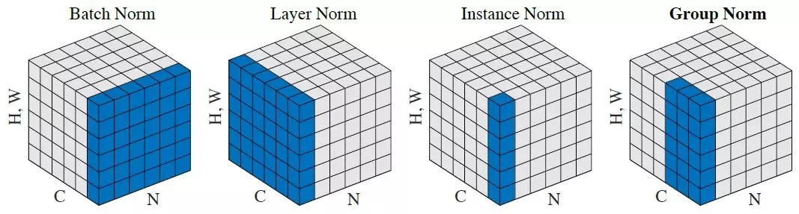
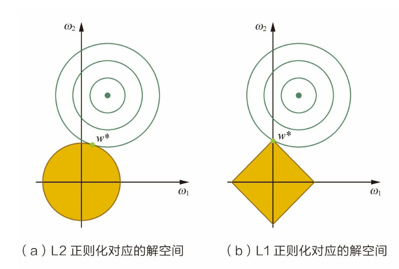
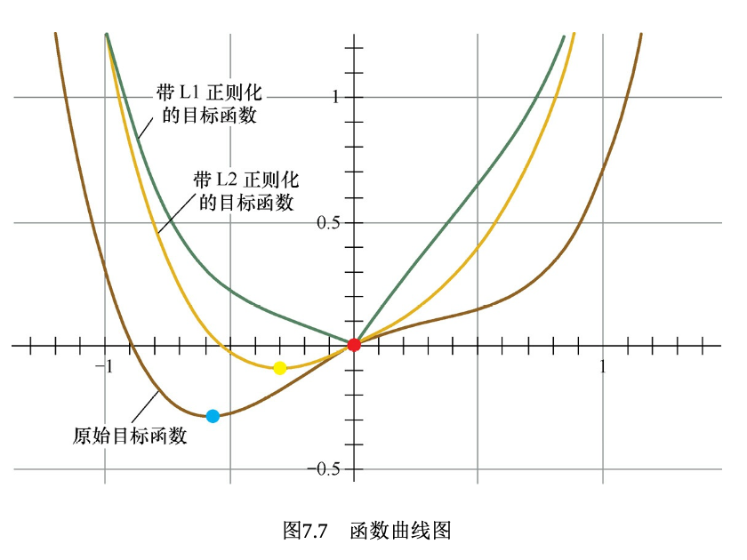
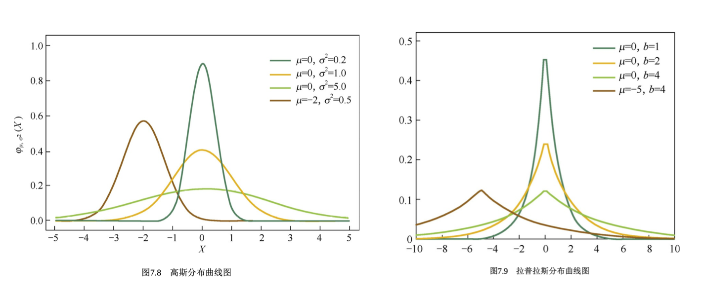
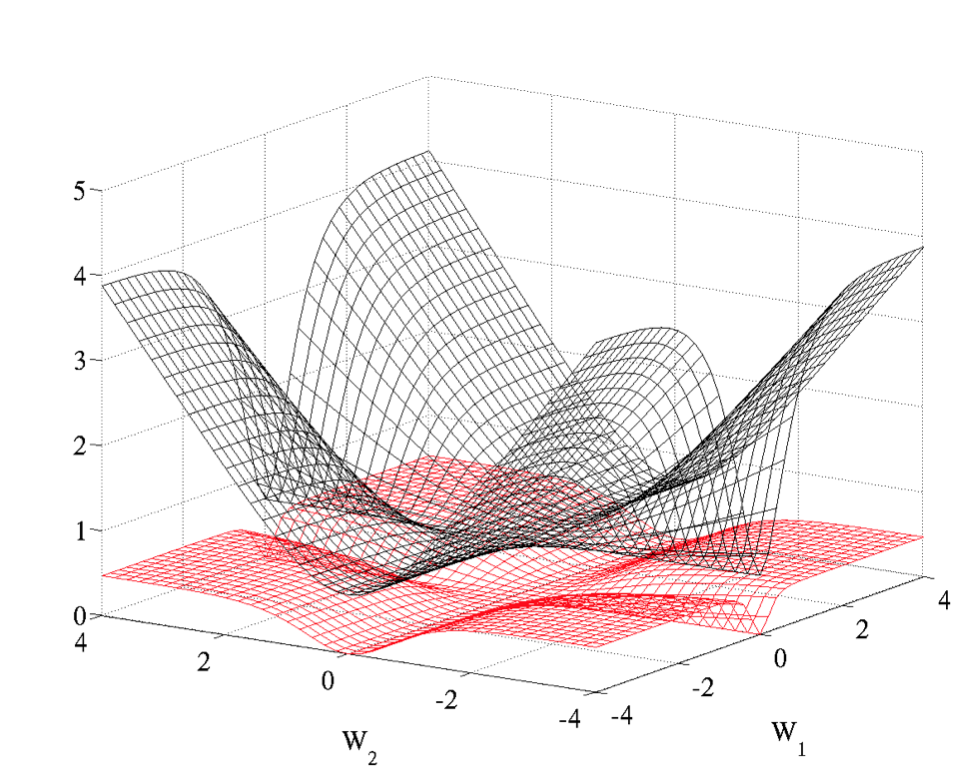

#### 1. 卷积的主要作用是稀疏交互和权值共享，解释两者的特性以及作用? :v:

（１）在卷积神经网络中，卷积核尺度远远小于输入的维度，这样每个输出神经元仅与前一层特定局部区域内的神经元存在连接权重．稀疏交互能够显著减少参数的数量，从而较好的改善过拟合情况。稀疏交互的物理意义在于， 通常图像，文本，语音等现实世界中的数据都具有局部的特征结构，我们可以先学习局部特征，再将局部特征组合起来形成更复杂和抽象的特征。
（２）参数共享: 在卷积神经网络中，卷积核中的每一个元素都将作用于每一次局部输入的特定位置上。根据参数共享的思想，我们只需要学习一组参数集合，而不需要针对每个位置的每个参数都进行优化.参数共享的物理意义在于使得参数具有平移等变性.

- 1x1卷积作用?  (1) 跨通道组织信息，并增加非线性(利用后接的非线性激活函数)．(2)升维和降维

- 转置卷积(逆卷积):　**逆卷积相对于卷积在神经网络结构的正向和反向传播中做相反的运算。逆卷积(Deconvolution)比较容易引起误会，转置卷积(Transposed Convolution)是一个更为合适的叫法．**

  

- 空洞卷积:  带有洞的卷积，**空洞卷积的好处是不做pooling损失信息的情况下，加大了感受野，让每个卷积输出都包含较大范围的信息。**
  

#### 2. 池化层的作用以及不同常见的池化操作? (mean pooling 以及 max pooling的反向传播):v:
常见的池化操作主要针对非重叠区域，包括均值池化、最大池化等。此外，特殊的池化方式还包括相邻重叠区域的池化(over-lapping)以及空间金字塔池化。

- 均值池化是通过对领域内特征数值求平均来实现，能够抑制由于领域大小受限造成估计值方差增大的现象，特点是对背景的保留效果更好。
- 最大池化则是通过取领域内特征的最大值来来实现，能够抑制网络参数误差造成估计均值偏移的现象，特点是更好地提取纹理信息。
- 重叠区域池化是采用比窗口宽度更小的步长，使得窗口在每次滑动时存在重叠区域。
- **空间金字塔池化主要考虑了多尺度信息的描述，例如同时计算1x1，2x2，4x4 的矩阵的池化并将结果拼接在一起作为下一网络层的输入**。
  


池化的**本质**是降采样，从而显著降低参数量，此外还能够保持对平移，伸缩，旋转操作的不变性。

无论max pooling还是mean pooling，都没有需要学习的参数。因此，在卷积神经网络的训练中，**Pooling层需要做的仅仅是将误差项传递到上一层，而没有梯度的计算**。

- max pooling层：对于max pooling，下一层的误差项的值会原封不动的传递到上一层对应区块中的最大值所对应的神经元，而其他神经元的误差项的值都是0；
- mean pooling层：对于mean pooling，下一层的误差项的值会平均分配到上一层对应区块中的所有神经元。


#### 3. 输入输出的计算，参数量的计算，感受野的计算， FLOPS   :v:

要时刻记住的是:　**输入通道数＝卷积核的通道数**　　**输出通道数＝卷积核的个数**

假设输入为　$W_1 * H_1 * D$， 卷积核个数为 $K$，尺寸为$F$，步长为 $S$，输出为  $W^\prime * H^\prime * K$

（１）关于输入和输出的计算:
$$
W_2=(W_1−F+2P)/S+1  \\
H_2=(H_1−F+2P)/S+1 \\
$$
（２）参数量为:  $F*F*D*K$

（３）感受野的计算:  假设 $s_0=1$，初始的感受野 $r_0$ 也为1。

- 对于卷积和池化执行如下操作:

$$
r_{l+1}=r_{l}+(k−1)∗s_{l}　\\
s_{l+1}=s_l∗s \\
$$

- 经过多分支的路径，按照感受野最大支路计算。
- 不会改变感受野的情况: conv1x1 s1、ReLU、BN、dropout、shotcut等元素级操作。
- 经过FC层和Gobal Ave Pooling 层，感受野就是整个输入图像。

~~~shell
， convnet =  [[11，4，0]， [3，2，0]， [5，1，2]， [3，2，0]， [3，1，1]　# [kernel_size， stride， padding]
layer_names = ['conv1'，'pool1'，'conv2'，'pool2'，'conv3']
conv1: receptive size: 11  # 1 + (11-1) * 1 = 11， s1 = 1 * 4 = 4
pool1: receptive size: 19  # 11 + (3-1) * 4 = 19， s2 = 4 * 2 = 8
conv2: receptive size: 51  # 19 + (5-1) * 8 = 51， s3 = 8 * 1 = 8 
pool2: receptive size: 67  # 51 + (3-1) * 8 = 67， s4 = 8 * 2 = 16
conv3: receptive size: 99  # 67 + (3-1) * 16 = 99， s5 = 16 * 1 = 16
~~~

(4) FLOPS:   $F*F*D*K * H^\prime * W^\prime$

#### 4. 常见的分类网络及其要点 :v:

- **Alexnet**

（1） 成功**使用ReLU作为CNN 的激活函数**，并验证其效果在较深的网络超过 Sigmoid， 成功解决了Sigmoid在网络较深时的梯度弥散问题。

（2） 训练时**使用Dropout随机忽略一部分神经元，以避免过拟合**。

（3）在CNN中**使用重叠的最大池化**。此前CNN 中普遍采用平均池化，AlexNet 全部使用最大池化，避免平均池化的模糊化效果。并且 AlexNet 中提出让步长比池化核的尺寸小，这样池化层的输出之间有重叠和覆盖，提高了特征的丰富性。

（4）提出**LRN层，对局部神经元的活动创建竞争机制**，使得其中响应比较大的值变得相对更大，并抑制其他反馈较小的神经元，增强模型的泛化能力。

（5） **使用CUDA加速深度卷积网络的训练**，利用GPU强大的并行能力，处理神经网络训练时大量的矩阵运算。

（6）**数据增强**，随机地从 256 x 256 的原始图像中截取 224 x 224 大小的区域（以及水平翻转的镜像）相当于增加了(256-224)^2 * 2 = 2048 倍的数据量。大大减轻了模型过拟合，提升泛化能力。同时 AlexNet 论文中提到了会对图像的RGB 数据进行PCA 处理，并对主成分做一个标准差为0.1的高斯扰动， 增加一些噪声。

- **VGG**

**VGGNet探索了卷积神经网络的深度与其性能之间的关系，通过反复堆叠3x3的小型卷积核和2x2 的最大池化层， VGGnet成功构筑了16~19层深的卷积神经网络**。**通过将多个卷积层堆叠在一起，可以减少参数数目的同时增加卷积层的非线性变换，使得CNN 对特征的学习能力更强**。

- **Google Inception Net**

（1）**精心设计了 Inception Module提高参数的利用效率，其结构如下所示，Inception Module中包含3种不同尺寸的卷积核1个最大池化，增加了网络对不同尺度的适应性**。

第一个分支对输入进行 1x1卷积，**1x1卷积可以跨通道组织信息，提高网络的表达能力，同时可以对输出通道升维和降维**。

第二个分支先使用了 1x1 卷积，然后连接 3x3 卷积，相当于进行两次特征变换。

第三个分支和第二个分支类似，先是使用了1x1 的卷积，然后连接 5x5 的卷积。

最后一个分支则是3x3 最大池化后直接使用1x1卷积。

Inception Module 的4个分支在最后通过一个聚合操作合并（再输出通道这个维度上聚合）

（2） **去除了最后的全连接层，用全局平均池化层来取代它**。

- **ResNet**

​        ResNet 通过调整网络结构来解决梯度消失问题（反向传播时，梯度将涉及多层参数的交叉相乘，可能会在离输入近的网络层中产生梯度消失的现象）。首先考虑两层神经网络的简单叠加，这时 $$x$$ 经过两个网络层的变换得到 $$H(x)$$ ， 激活函数采用  $$ReLU$$， 如下图$$(a)$$所示。既然离输入近的神经网络层较难训练，那么我们可以将它短接到更靠近输出的层，如下图$$(b)$$所示。输入 $$x$$ 经过两个神经网络变换得到 $$F(x)$$，同时也短接到两层之后，最后这个包含两层的神经网络模块输出 $$H(x) = F(x) + x$$。这样一来， $$F(x)$$ 被设计为只需要拟合输入$$x$$ 与目标输入$$\tilde{H}(x)$$的残差$$\tilde{H}(x)-x$$ ， 残差网络的名称也因此而来。**如果某一层的输出已经较好的拟合了期望结果，那么多加入一层也不会使得模型变得更差，因为该层的输出将直接短接到两层之后，相当于直接学习了一个恒等映射，而跳过的两层只需要拟合上层输出和目标之间的残差即可。**


- **SENet**

  采用了一种全新的**「特征重标定」**的策略。具体来说，就是**通过学习的方式来自动获取到每个特征通道的重要程度，然后依照这个重要程度去提升有用的特征并抑制对当前任务用处不大的特征**。

  

- **Densenet**
  DenseNet 的目标是**提升网络层级间信息流与梯度流的效率，并提高参数效率**。它也如同 ResNet 那样连接前层特征图与后层特征图，但 DenseNet 并不会像 ResNet 那样对两个特征图求和，而是**直接将特征图按深度相互拼接在一起**。**DenseNet 最大的特点即每一层的输出都会作为后面所有层的输入，这样最后一层将拼接前面所有层级的输出特征图。这种结构确保了每一层能从损失函数直接访问到梯度，因此可以训练非常深的网络**。

  - 关于通道的求和与拼接?
     (1) 常见的 **add 操作**见于 resnet 和 FPN、CPN。 而 concat 操作见于 Unet 和 Dense net。
    (2)  **add等价于concat之后对应通道共享同一个卷积核**。当两路输入可以具有“对应通道的特征图语义类似” 的性质的时候，可以用add来替代concat，这样**更节省参数和计算量**（concat是add的2倍）。

#### 5. 批归一化(batch normlization)的作用及其实现 :v:

研究动机:  **神经网络训练过程的本质是学习数据分布**，如果训练数据与测试数据的分布不同将大大降低网络的泛化能力，因此我们需要在训练开始前对所有输入数据进行归一化处理。然而**随着网络训练的进行，每个隐层的参数变化使得后一层的输入发生变化，从而每一批训练数据的分布也随之改变，致使网络在每次迭代中都需要拟合不同的数据分布，增大训练的复杂度以及过拟合的风险。这被称为内部协方差偏移（ICS）**.

实现: 

（１）批量归一化方法是针对每一批数据，在网络的每一层输入之前增加归一化处理(均值为0，标准差为1)，将所有批数据强制在统一的数据分布下.即对该层的任意一个神经元(假设为第k维) $\hat{x}^{(k)}$采用如下公式:
$$
\hat{x}^{(k)} = \frac{x^{(k)}-E[x^{(k)}]}{\sqrt{Var[x^{(k)}]}}
$$
其中$x(k)$为该层第 $k$ 个神经元的原始输入数据，$E[x(k) ]$为这一批输入数据在第 $k$ 个神经元的均值，$Var[x^{(k)}]$ 为这一批数据在第$k$个神经元的标准差。

（２）归一化后的 $x(k)$ 基本会被限制在正态分布下，使得网络的表达能力下降。为解决该问题，我们引入两个新的参数：$\gamma$和$\beta$。 就可以恢复最优的输入数据分布。$\gamma$ 和 $\beta$ 是在训练时网络自己学习得到的。
$$
y^{(k)} = \gamma^{(k)} \hat{x} ^{(k)} + \beta^{(k)}
$$
**注意点:**

- 由于卷积神经网络的参数共享机制。每一个卷积核的参数在不同位置的神经元当中是共享的，因此也应该被一起归一化。**假设网络训练中每一批包含$b$个样本，由一个卷积核生成的特征图的宽高分别为 $w$ 和 $h$， 则每个特征图所对应的全部神经元个数为 $b×w×h$**.

- **对于预测阶段，我们所使用的均值和方差，是整个训练样本的均值和方差的期望值．**

#### 6. Dropout的原理与实现  :v:

​        **训练过程中，对于每个 mini-batch, 每个神经元以 $p\%$的概率随机失活，这样每次都对一个更加精简的网络进行训练。而在测试过程中每个神经元的参数要预先乘以概率系数 $p$，以恢复在训练中该神经元只有 $p$ 的概率被用于整个神经网络的前向传播计算。**

如何理解dropout取得如此好的效果：

**（1）在训练过程中，随机失活可以被认为是对完整的神经网络抽样出一些子集，每次基于输入数据只更新子网络中的参数。在测试过程中不使用随机失活，可以理解为是对数量巨大的子网络做模型集成(类似于bagging，但是其参数是共享的)。**

**（2）从单个神经元来看，因为每个输入都有可能被随机清除，所以神经元不依赖于某个特定的输入，所以不会在任何的一个输入加上太多的权重。这和L2正则化有异曲同工之妙。**

**注意点**：

（1）Dropout 是一种正则化的方法，如果模型并没有过拟合，不应该使用dropout。

（2）Dropout中 keep_prob 值的设置问题：经过交叉验证，隐含节点dropout率等于0.5的时候效果最好, dropout也可以被用作一种添加噪声的方法，直接对input进行操作。输入层设为更接近1的数(0.8)。使得输入变化不会太大。对于每一层，可以设置不同的keep_prob, 我们倾向于对结点较多的层使用较低的keep_prob(保留更少节点)。

（3）Dropout 的使用使得无法有效的检验损失函数的下降，此时可以暂时的关闭dropout来检查损失函数值。

####　7. 常见的激活函数及其导数?  :v:

Sigmoid 激活函数的形式为   $$f(z) = \frac{1}{1+e^{-z}}$$， 对应的导函数为    $f'(z) = f(z)(1-f(z))$

Tanh激活函数的形式为   $f(z) = \frac{e^{z} - e^{-z}}{e^{z}+e^{-z}}$，   对应的导函数为$f'(z) = 1 - (f(z))^2$ 

ReLU 激活函数的形式为  $f(z) = max(0，z)$，   对应的导函数为   $$f'(z)=\left\{
\begin{aligned}
1，z > 0 \\
0，z \leq 0 \\
\end{aligned}
\right.$$

#### 8. Relu的优缺点以及Relu的常见改进   :v:

优点：

（1）从计算角度上， Sigmoid 和 tanh 激活函数均需要计算指数，复杂度高，而ReLU只需要一个阈值即可得到激活值。

（2）ReLU 的线性非包含特性可以有效地解决梯度消失问题，提供相对较宽的激活边界。

（3）ReLU的单侧抑制提供了网络的稀疏表达能力。  

局限性：在训练过程中会会导致神经元死亡的问题。这是由于 $f(z) = max(0，z)$  导致负梯度在经过该ReLU 单元时被置为0， 且在之后也不被任何数据激活，即流经该神经元的梯度永远为0， 不对任何数据产生响应。在实际训练中，如果学习率设置较大，会导致超过一定比例的神经元不可逆死亡，进而参数梯度无法更新，整个训练过程失败。

**一些ReLU 的改进措施**：

（1）Leaky ReLU（LReLU）

Leaky ReLU 的表示形式为：$$f(z)=\left\{
\begin{aligned}
z，z > 0 \\
\alpha z，z \leq 0 \\
\end{aligned}
\right.$$ ， Leaky ReLU 与 ReLU 的区别在于当 $z\le 0$ 时， 其值不为零，一般来说a 为一个很小的常数(0.01或者0.001数量级的较小整数)，这样既实现了单侧抑制，又保留了部分负梯度信息以致不完全丢失。但另一方面，$ \alpha$  为超参数，较难设置为合适的值，且较为敏感，因此Leaky ReLU 函数在实际使用中的性能部分十分稳定。

（2）参数化 ReLU（Parametric  ReLU，PReLU）：PReLU将负轴部分斜率$ \alpha$ 作为网络中的一个可学习的参数融入模型的整体训练过程。有几点有趣的现象需要注意：

（3）随机化ReLU(Random ReLU，RReLU）：增加了“随机化机制， 其取值在训练阶段服从均匀分布，在测试阶段则将其指定为该均匀分布对应的数学期望 $ \frac{l+u}{2}\ $。

（4）指数化线性单元（Exponential Linear Unit， ELU）：2016年 Clevert 等人提出了指数化线性单元 ELU，其公式为： $$ELU(x)=\left\{
\begin{aligned}
x，x \ge 0 \\
\lambda \cdot (e^x - 1)，z \lt 0 \\
\end{aligned}
\right.$$。ReLU 具备了 ReLU 函数的优点，同时也解决了ReLU 函数自身的“死区”问题。不过ELU 函数中的指数操作稍稍增大了计算量。在实际应用中，ELU 中的超参数 $\lambda$ 一般被设置为1。

#### 9. 如何选择激活函数  :v:

**使用激活函数是为了引入非线性从而产生强大的表达能力**。关于激活函数的选择：首先使用最常用的ReLU 激活函数，但是需要注意模型参数的初始化操作和学习率的设置。为了进一步提高模型精度，可以尝试使用 Leaky ReLU、参数化 ReLU、随机化 ReLU 和 ELU。但是四者的实际性能优劣并无一致性结论，需要具体问题具体分析.

#### 10. 学习率lr的设定   :v:

**模型刚开始的初始学习率不宜过大，以 0.01 和 0.001 为宜**；如果发现刚开始训练没几个批次模型的损失值就急剧上升，说明模型训练的学习率过大，此时应该减小学习率，从头训练。

**常见的学习率有以下几种方式**：

- 学习率减缓 (轮次减缓、指数减缓和分数减缓)

- 周期性学习率：余弦退火 or 周期性学习率。
- Warmup：当step小于warm up setp时，学习率等于基础学习率×(当前step/warmup_step)，此时学习率是一个递增的过程。当warm up结束后，学习率开始递减。

#### 11.常见的初始化方式(推导Xavier参数)    :v:

**不要使用全零初始化， 这样会导致网络不同神经元的输出相同，相同的输出导致梯度更新完全一样，这样便会令更新后的参数仍然保持一样的状态，从而无法对模型进行训练。比较推荐的网络初始化方式为 He 方式，将参数初始化为服从高斯部分或者均匀分布的较小随机数，同时对参数方差需要加以规范化**。
（1）高斯分布：设输入神经元的个数为$n_{in}$，输出神经元的个数为$n_{out}$. 则服从高斯分布的参数随机初始化为:

```python
w = (0.001 * randn(n_in, n_out)) / sqrt(n/2)  # He method
```

其中 0.001为控制参数量纲的因子．n 为输入神经元的个数$n_{in}$ , 有时也可指定为 $(n_{in}+n_{out})/2$

（2）均匀分布： 设输入神经元的个数为$n_{in}$，输出神经元的个数为$n_{out}$.　则服从均匀的参数随机初始化为:

```python
# He mothod
low = -sqrt(6/n)
high = sqrt(6/n)
w = 0.001 * (low + (high - low) * rand(n_in, n_out))
```

**借助预训练模型中的参数作为新任务的参数初始化方式**一种简便且十分有效的模型参数初始化方法。

####12. 数据量偏少怎么办？:v:

**数据扩充，即根据一些先验知识，在保证特定信息的前提下，对原始数据进行适当变换，以达到扩充数据集的效果**。有效的数据扩充，不仅能够扩充训练数据集，还能增加数据多样性。一方面能够避免过拟合，另一方面，又会带来性能的提升。具体到图像分类任务，在保持图像类别不变的前提下，可以对训练集中的每幅图像进行以下变换：

**数据层面：**

- 在一定程度内的**随机旋转(rotating)**、**平移**、**缩放(scaling)**、**裁剪(cropping)**、**填充**、**上下左右翻转(flipping)**等。这些变换对应着同一个目标在不同角度的观察结果。
- **色彩抖动（color jittering）：**在原图的RGB颜色空间进行轻微的扰动，也可以在**HSV 颜色空间**尝试改变原有的饱和度、明度(V)和色调(H)．
- 改变图像的亮度、清晰度、对比度、锐度等。
- **FancyPCA**。

**算法层面：**

- 先对图像进行特征提取， 然后在图像的**特征空间内进行变换**，利用一些通用的数据扩充或者上采样技术，例如 **SMOTE 算法**。
- 使用**生成模型**也可以合成一些新样本，例如当今非常流行的对抗生成网络。
- 使用 **Fine-tune** 进行微调
- **小样本学习**

####13. 数据不平衡怎么办？ :dizzy_face:


#### 14. Group Normalization 组归一化 :v:

​        **Group Normalization** 是为了解决Batch Normalization 对较小的mini-batch 效果差的问题( 没办法通过几个样本的数据量，来近似总体的均值和标准差)。其主要思想是在 channel 方向 group，然后每个 group 内做归一化，计算 ![[公式]](https://www.zhihu.com/equation?tex=%28C%2FG%29%2AH%2AW) 的均值和方差，这样就与batch size无关，不受其约束。**Group Normalization 把每一个样本特征图的通道分成 G 组，对每组求均值和标准差，并独立地进行归一化。**

参考代码如下：

```python
def GroupNorm(x, gamma, beta, G=16):

    # x_shape:[N, C, H, W]
    results = 0.
    eps = 1e-5
    x = np.reshape(x, (x.shape[0], G, x.shape[1]/16, x.shape[2], x.shape[3]))

    x_mean = np.mean(x, axis=(2, 3, 4), keepdims=True)
    x_var = np.var(x, axis=(2, 3, 4), keepdims=True0)
    x_normalized = (x - x_mean) / np.sqrt(x_var + eps)
    results = gamma * x_normalized + beta
    return results
```

**几种常见的归一化：**



#### 15. 反向传播的推导  :v:

反向传播的本质是全微分+ 链式法则。  从最后一层向前，逐层求出最终的损失函数对权重 $W$ 和偏置 $b$ 的偏导。

假设前向传播为:
$$
z^l_j = \sum_\limits{k} w_{jk}^{l} a_k^{l-1} + b_j^l \\
a_j^l = \sigma(z^l_j)  \\
C = \frac{1}{2n} \sum_\limits{x} ||y(x) - a^L(X)||^2
$$
反向推导四个公式为：
$$
\delta^L = \Delta_aC \odot \sigma'(z^L) \\
\delta^l = ((W^{(l+1)})^T \delta^{l+1}) \odot \sigma'(z^l) \\
\frac{\partial C}{\partial b^l_j} = \delta_j^l \\
\frac{\partial C}{\partial w_{jk}^l} = a_k^{l-1} \delta_j^l
$$


参考链接：http://neuralnetworksanddeeplearning.com/chap2.html

#### 16. 为什么会产生梯度消失和梯度爆炸现象？  :v:

​        在反向传播的过程中， 会产生导数和参数的连乘。对于sigmoid 函数，导数的最大值也仅仅是 0.25。而初始化权重参数$W$ 通常小于1。 多层神经网络会造成多个小于1的值连乘，导致输入层的梯度几乎为0， 得不到更新。梯度爆炸也是同样的原因， 只是初始化权重较大， 造成多个大于1的值连乘，导致梯度更新过大， 模型无法收敛。

#### 17.  $l_1$正则化使得模型具有稀疏性的原理是什么？  :v:

这道题目可以从三个方向进行分析：

**（1） 解空间形状：**

在二维的情况下， 黄色的部分是 $L_2$ 和 $L_1$ 正则项约束后的解空间， $L_2$ 正则项约束后的解空间是圆形， 而$L_1$ 正则项约束的解空间是多边形。显然， 多边形的解空间更容易在尖角处与等高线碰撞出稀疏解。



**（2）函数叠加：**

仅考虑一维的情况，多维情况是类似的，如下图所示。假设棕线是原始目标函数 $L(w)$的曲线图，显然最小值点在蓝点处，且对应的 $w$值非0。


- 考虑加上$L_2$正则化项，目标函数变成$L(w)+Cw^2$，其函数曲线为黄色。 此时，最小值点在黄点处，对应的w的绝对值减小了，但仍然非0。 
- 考虑加上$L_1$正则化项，目标函数变成$L(w)+C|w|$，其函数曲线为绿色。 此时，最小值点在红点处，对应的$w$是0，产生了稀疏性。 

​    产生上述现象的原因也很直观。加入L1正则项后，对带正则项的目标函数求 导，正则项部分产生的导数在原点左边部分是 $−C$，在原点右边部分是$C$，因此， 只要原目标函数的导数绝对值小于$C$，那么带正则项的目标函数在原点左边部分始 终是递减的，在原点右边部分始终是递增的，最小值点自然在原点处。相反，$L_2$ 正则项在原点处的导数是0，只要原目标函数在原点处的导数不为0，那么最小值 点就不会在原点，所以$L_2$只有减小$w$绝对值的作用，对解空间的稀疏性没有贡献。 

**贝叶斯先验：**

​        从贝叶斯的角度来理解L1正则化和L2正则化，简单的解释是，$L_1$正则化相当 于对模型参数$w$引入了拉普拉斯先验，$L_2$正则化相当于引入了高斯先验，而拉普拉斯先验使参数为0的可能性更大。 



下图左是高斯分布曲线图。由图可见，高斯分布在极值点(0点)处是平滑的， 也就是高斯先验分布认为$w$在极值点附近取不同值的可能性是接近的。这就是$L_2$正 则化只会让$w$更接近0点，但不会等于 0 的原因。 相反，下图右是拉普拉斯分布曲线图。由图可见，拉普拉斯分布在极值点(0点)处是一个尖峰，所以拉普拉斯先验分布中参数$w$取值为0的可能性要更高。

#### 18. 交叉熵 与平方差损失函数的区别与选择?  :v:

​    一般来说， 平方差损失函数更适合输出为连续， 并且最后一层布包含sigmoid或者softmax激活函数的神经网络。交叉熵更适合二分类或者多分类的场景。
**为什么？**
​        回顾反向传播中平方误差损失函数相对于输出层的导数： $\delta^{(l)} = -(y-a^{(L)}) f'(z^{(L)})$， 其中最后一项 $f'(z^{(L)})$ 为激活函数的导数。当激活函数为 Sigmoid 函数时， 如果 $z^{(L)}$ 的绝对值较大， 函数的梯度就会趋于饱和， 即 $f'(z^{(L)})$ 的绝对值非常小， 导致 $\delta^{(L)} $的取值也非常小， 使得基于梯度的学习速度非常缓慢。
​        当使用交叉熵损失函数时， 相对于输出层的导数为: $\delta^{(L)} = a_k^{(L)} - 1$ 此时的导数是线性的，因此不会存在学习速度过慢的问题。



反应在图片上就是 cross entropy曲面陡峭，因此当初始值距离目标值越远微分值越大，参数更新越快；square eerror的曲面和平坦，当初始值距离目标值远时微分值也不大，参数更新慢，一开始就卡住，即使考虑在微分值很小把学习速率设置大也不可行，因为当趋近于目标值的时候微分值也很小，过大的学习速率会导致跨过目标值的点。
参考论文: Understanding the difficulty of training deep feedforward neural networks

#### 19. 如何降低验证集和训练集之间的损失的差距？

过拟合是指模型对于训练数据拟合呈过当的情况，反映到评估指标上，就是模型在训练集上的表现很好，但在测试集和新数据上的表现较差。欠拟合指的是模型在训练和预测时表现都不好的情况。下图形象地描述了过拟合和欠拟合的区 别。 


图(a)是欠拟合的情况，拟合的黄线没有很好地捕捉到数据的特征，不能够很好地拟合数据。图(c)则是过拟合的情况，模型过于复杂，把噪声数据的特征也学习到模型中，导致模型泛化能力下降，在后期应用过程中很容易输出错误的预测结果。 

**降低过拟合风险的方法** 

(1) 从数据入手，获得更多的训练数据。使用更多的训练数据是解决过拟合问题最有效的手段，因为更多的样本能够让模型学习到更多更有效的特征，减小噪声的影响。当然，直接增加实验数据一般是很困难的，但是可以通过一定的规 则来扩充训练数据。比如，在图像分类的问题上，可以通过图像的平移、旋转、 缩放等方式扩充数据；更进一步地，可以使用生成式对抗网络来合成大量的新训练数据。 

(2) 降低模型复杂度。在数据较少时，模型过于复杂是产生过拟合的主要因 素，适当降低模型复杂度可以避免模型拟合过多的采样噪声。例如，在神经网络 模型中减少网络层数、神经元个数等;在决策树模型中降低树的深度、进行剪枝 等。 

(3) 正则化方法。给模型的参数加上一定的正则约束，比如将权值的大小加入到损失函数中。在优化原来的目标函数的同时，也能避免权值过大带来的过拟合风险。 

(4)集成学习方法。集成学习是把多个模型集成在一起，来降低单一模型的过拟合风险，如Bagging方法。 

**降低欠拟合风险的方法** 

(1)添加新特征。当特征不足或者现有特征与样本标签的相关性不强时，模型容易出现欠拟合。通过新的特征，往 往能够取得更好的效果。在深度学习潮流中，有很多模型可以帮助完成特征工 程，如因子分解机、梯度提升决策树、Deep-crossing等都可以成为丰富特征的方 法。 

(2)增加模型复杂度。简单模型的学习能力较差，通过增加模型的复杂度可 以使模型拥有更强的拟合能力。例如，在线性模型中添加高次项，在神经网络模 型中增加网络层数或神经元个数等。 

(3) 减小正则化系数。正则化是用来防止过拟合的，但当模型出现欠拟合现 象时，则需要有针对性地减小正则化系数。 

#### 21. 常见的优化器，选择，优缺点  :dizzy_face:


softmax 魔改

#### 22.超参数调参

**batch_size**: 当设置 batch_size 为1时， 会发生什么问题？ 当设置 batch_size 等于数据集大小时， 会发生什么问题？ 当设置 batch_size 为1时，梯度下降会非常随机， 可能需要很长时间才能收敛， 但是需要较小的显存占用。当设置 batch_size 等于数据集大小时 ，需要很大的显存占用， 可能会快速收敛并导致过拟合。相比之下， mini-batch 梯度下降可能梯度下降到较好的地方。

19. boost vs bagging

梯度下降法 和 牛顿法 的区别和联系

#### 18. 评价指标相关

#### 19. 方差和偏差的理解以及两者和boost以及bagging的联系