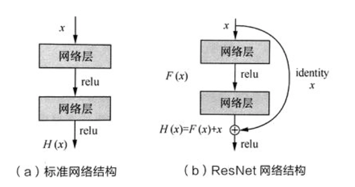

### 1. 卷积操作的本质特性包括稀疏交互和参数共享，具体解释着两种特性及其作用？

- 稀疏交互(sparse interaction)

  在传统的神经网络中，任意一对输入和输出神经元之间都产生交互，形成稠密的连接结构，如下左图所示。而**在卷积神经网络中，卷积核尺度远远小于输入的维度，这样每个输出神经元仅与前一层特定局部区域内的神经元存在连接权重**，如下右图所示。我们称这种特性为稀疏交互。

  

  **稀疏交互能够显著减少参数的数量，从而较好的改善过拟合情况。稀疏交互的物理意义在于， 通常图像，文本，语音等现实世界中的数据都具有局部的特征结构，我们可以先学习局部特征，再将局部特征组合起来形成更复杂和抽象的特征**。

- 参数共享(parameter sharing)

  **在卷积神经网络中，卷积核中的每一个元素都将作用于每一次局部输入的特定位置上。根据参数共享的思想，我们只需要学习一组参数集合，而不需要针对每个位置的每个参数都进行优化**，从而大大降低模型的存储需求。
  **参数共享的物理意义在于使得参数具有平移等变性**。假设图像这种有一只猫，那么无论出现在图像的任何位置，我们都应该将它识别为猫，也就是说神经网络的输出对于平移变换来说应当是等变的。特别地，先将图片进行卷积运算，然后再进行平移和先进行平移，再进行卷积运算两者是相等的。

### 2. 常用的池化操作有哪些？池化的作用是什么？

**常见的池化操作主要针对非重叠区域，包括均值池化(mean pooling)、最大池化(max pooling)等。此外，特殊的池化方式还包括相邻重叠区域的池化(over-lapping)以及空间金字塔池化**。

- 均值池化是通过对领域内特征数值求平均来实现，能够抑制由于领域大小受限造成估计值方差增大的现象，特点是对背景的保留效果更好。
- 最大池化则是通过取领域内特征的最大值来来实现，能够抑制网络参数误差造成估计均值偏移的现象，特点是更好地提取纹理信息。
- 重叠区域池化是采用比窗口宽度更小的步长，使得窗口在每次滑动时存在重叠区域。
- **空间金字塔池化主要考虑了多尺度信息的描述，例如同时计算1x1，2x2，4x4 的矩阵的池化并将结果拼接在一起作为下一网络层的输入**。

**池化的本质是降采样，从而显著降低参数量，此外还能够保持对平移，伸缩，旋转操作的不变性**。

### 3. 常见基本分类网络的要点

- **Alexnet**

（1） 成功**使用ReLU作为CNN 的激活函数**，并验证其效果在较深的网络超过 Sigmoid， 成功解决了Sigmoid在网络较深时的梯度弥散问题。

（2） 训练时**使用Dropout随机忽略一部分神经元，以避免过拟合**。

（3）在CNN中**使用重叠的最大池化**。此前CNN 中普遍采用平均池化, AlexNet 全部使用最大池化，避免平均池化的模糊化效果。并且 AlexNet 中提出让步长比池化核的尺寸小，这样池化层的输出之间有重叠和覆盖，提高了特征的丰富性。

（4）提出**LRN层，对局部神经元的活动创建竞争机制**，使得其中响应比较大的值变得相对更大，并抑制其他反馈较小的神经元，增强模型的泛化能力。

（5） **使用CUDA加速深度卷积网络的训练**，利用GPU强大的并行能力，处理神经网络训练时大量的矩阵运算。

（6）**数据增强**，随机地从 256 x 256 的原始图像中截取 224 x 224 大小的区域（以及水平翻转的镜像）相当于增加了(256-224)^2 * 2 = 2048 倍的数据量。大大减轻了模型过拟合，提升泛化能力。同时 AlexNet 论文中提到了会对图像的RGB 数据进行PCA 处理，并对主成分做一个标准差为0.1的高斯扰动， 增加一些噪声。

- **VGGNet**

**VGGNet探索了卷积神经网络的深度与其性能之间的关系，通过反复堆叠3x3的小型卷积核和2x2 的最大池化层， VGGnet成功构筑了16~19层深的卷积神经网络**。

（1）**通过将多个卷积层堆叠在一起，可以减少参数数目的同时增加卷积层的非线性变换，使得CNN 对特征的学习能力更强**。

（2）VGGNet 在训练时有个小技巧，先训练级别A的简单网络，再复用A网络的权重来初始化后面几个复杂模型，这样训练收敛的速度更快。

（3）在测试，VGG 采用了 Multi-Scale 的方法，将 图像scale到一个尺寸Q， 并将图片输入卷积网络运算。再将不同尺寸Q的结果平均得到最后结果，这样提高图片数据的利用率并提升准确率。同时在训练中还是用了Multi-Scale 的方法做数据增强。

- **Google Inception Net**

（1）**精心设计了 Inception Module提高参数的利用效率，其结构如下所示，Inception Module中包含3种不同尺寸的卷积核1个最大池化，增加了网络对不同尺度的适应性**。

第一个分支对输入进行 1x1卷积，**1x1卷积可以跨通道组织信息，提高网络的表达能力，同时可以对输出通道升维和降维**。

第二个分支先使用了 1x1 卷积，然后连接 3x3 卷积，相当于进行两次特征变换。

第三个分支和第二个分支类似，先是使用了1x1 的卷积，然后连接 5x5 的卷积。

最后一个分支则是3x3 最大池化后直接使用1x1卷积。

Inception Module 的4个分支在最后通过一个聚合操作合并（再输出通道这个维度上聚合）

（2） **去除了最后的全连接层，用全局平均池化层来取代它**。

- **ResNet**

​        ResNet 通过调整网络结构来解决梯度消失问题（反向传播时，梯度将涉及多层参数的交叉相乘，可能会在离输入近的网络层中产生梯度消失的现象）。首先考虑两层神经网络的简单叠加，这时 $$x$$ 经过两个网络层的变换得到 $$H(x)$$ ,  激活函数采用  $$ReLU$$， 如下图$$(a)$$所示。既然离输入近的神经网络层较难训练，那么我们可以将它短接到更靠近输出的层，如下图$$(b)$$所示。输入 $$x$$ 经过两个神经网络变换得到 $$F(x)$$, 同时也短接到两层之后，最后这个包含两层的神经网络模块输出 $$H(x) = F(x) + x$$。这样一来， $$F(x)$$ 被设计为只需要拟合输入$$x$$ 与目标输入$$\tilde{H}(x)$$的残差$$\tilde{H}(x)-x$$ ， 残差网络的名称也因此而来。**如果某一层的输出已经较好的拟合了期望结果，那么多加入一层也不会使得模型变得更差，因为该层的输出将直接短接到两层之后，相当于直接学习了一个恒等映射，而跳过的两层只需要拟合上层输出和目标之间的残差即可。**

