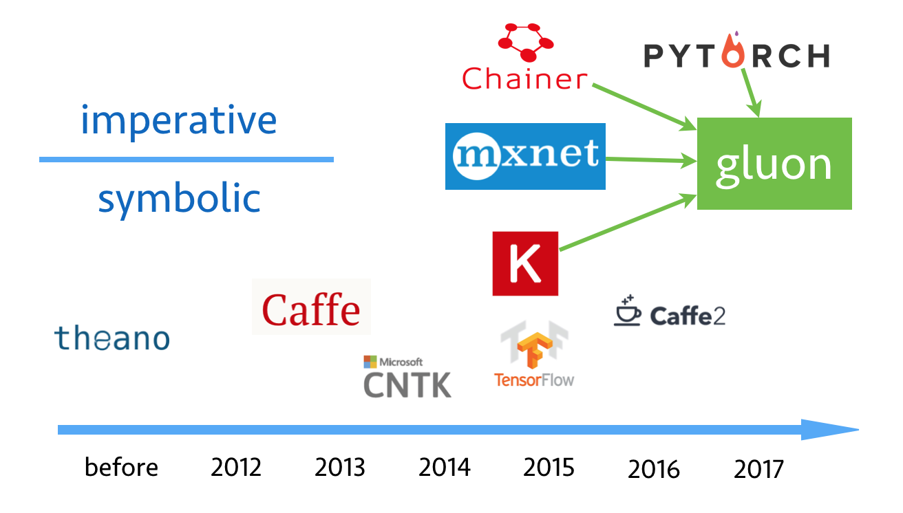
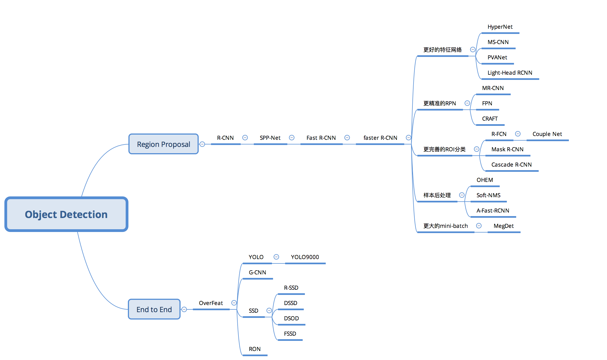

## Deep Learning Summary

[TOC]

### 1. Course

##### machine learning 

coursera: machine learning  https://www.coursera.org/learn/machine-learning

Stanford: CS229: Machine Learning  <http://cs229.stanford.edu>

##### deep learning 

coursera: deep learning    <https://www.coursera.org/specializations/deep-learning>

coursera: Neural Networks for Machine Learning    <https://www.coursera.org/learn/neural-networks>

udacity: deep learning foundation

Stanford: CS230 Deep Learning <https://web.stanford.edu/class/cs230/>

CMU: 11-785 Introduction to Deep Learning   http://deeplearning.cs.cmu.edu/

MIT 6.S191: Introduction to Deep Learning  <http://introtodeeplearning.com>

STAT 157 Introduction to Deep Learning http://courses.d2l.ai/berkeley-stat-157/index.html

Fast.ai: Practical Deep Learning For Coders   <http://course.fast.ai>  

1天搞懂深度学习 [http://www.slideshare.net/tw_dsconf/ss-62245351?qid=108adce3-2c3d-4758-a830-95d0a57e46bc&v=&b=&from_search=3](https://link.zhihu.com/?target=http%3A//www.slideshare.net/tw_dsconf/ss-62245351%3Fqid%3D108adce3-2c3d-4758-a830-95d0a57e46bc%26v%3D%26b%3D%26from_search%3D3) [中文]

ADLxMLDS  <https://www.youtube.com/channel/UCyB2RBqKbxDPGCs1PokeUiA/videos>[中文]

##### computer vision

stanford: CS231n Convolutional Neural Networks for Visual Recognition<http://cs231n.github.io>

PS: https://zhuanlan.zhihu.com/p/21930884  [中]  http://www.mooc.ai/course/268  [中]

##### NLP

Stanford: CS224d:Deep Learning for Natural Language Processing  <http://cs224d.stanford.edu>

Stanford: CS224n: Natural Language Processing with Deep Learning http://web.stanford.edu/class/cs224n/

CMU: CS 11-747, Spring 2018 Neural Networks for NLP   http://phontron.com/class/nn4nlp2018/

Oxford:Deep Learning NLP -2017 https://github.com/oxford-cs-deepnlp-2017/lectures

##### Reinforement Learning 

UCL Course on RL http://www0.cs.ucl.ac.uk/staff/D.Silver/web/Teaching.html

UCB S 285: Deep Reinforcement Learning    http://rail.eecs.berkeley.edu/deeprlcourse/

Stanford CS234: Reinforcement Learning Winter 2019  http://web.stanford.edu/class/cs234/index.html

李宏毅深度强化学习(中文)课程(2018)　https://www.bilibili.com/video/av24724071/?p=1

Deep Mind & UCL: Advanced of Deep  Learning & Reinforcement Learning 

https://www.youtube.com/playlist?list=PLqYmG7hTraZDNJre23vqCGIVpfZ_K2RZs

##### AI systems

UCB: CS294 AI-Sys Spring 2019  https://ucbrise.github.io/cs294-ai-sys-sp19/

Washington university: Systems for ML:  http://dlsys.cs.washington.edu/

##### Unsupervised Learning

UCB: CS294-158 Deep Unsupervised Learning Spring 2019   https://sites.google.com/view/berkeley-cs294-158-sp19/home

##### Probabilistic Graphical

CMU: Probabilistic Graphical Models: http://www.cs.cmu.edu/~epxing/Class/10708/lecture.html

Stanford: Probabilistic Graphical:https://www.coursera.org/learn/probabilistic-graphical-models

**Others**

MIT 6.S099: Artificial General Intelligence: <https://agi.mit.edu>

MIT 6.S094: Deep Learning for Self-Driving Cars <https://selfdrivingcars.mit.edu>

### 2. Deep Learning Framework

##### PC/Server  

- **Tensorflow** (google)    

Tensorflow 官网中国备份地址  <https://tensorflow.google.cn/>  

Tensorflow github 地址  <https://github.com/tensorflow/tensorflow> 

Tensorflow serving github 地址<https://github.com/tensorflow/serving> 

Stanford  tensorflow 教程 <https://web.stanford.edu/class/cs20si/>       

- **Mxnet** (amazon)       

论坛：<https://discuss.gluon.ai>

李沐深度学习教程主页：<http://zh.gluon.ai/index.html>

课程源代码：<https://github.com/mli/gluon-tutorials-zh>

Github 主页：<https://github.com/apache/incubator-mxnet>

mxnet 主页：<http://mxnet.readthedocs.io/en/latest/>

- **Caffe2 + Pytorch**  (facebook)   pytorch for research ，caffe2 for production

pytorch zerotoall   <https://github.com/hunkim/PyTorchZeroToAll

caffe tutorial  <http://caffe.berkeleyvision.org/tutorial/>

##### Mobile

**Tensorflow: Tensorflow-lite**

**Pytorch: caffe2**  (facebook)

**Apple: Core-ml**  (apple)

**ncnn** (Tencent) <https://github.com/Tencent/ncnn>

**paddle-mobile** (Baidu)  <https://github.com/baidu/mobile-deep-learning>

**mace**(Xiaomi)  https://github.com/XiaoMi/mace

**mnn**(Alibaba)   https://github.com/alibaba/MNN

##### Others

**TVM**: https://github.com/dmlc/tvm

**TC**: TensorComprehensions

**Onnx**: <https://github.com/onnx/onnx>

### 3. confluence 

### 4. Books

Pattern Recognition and Machine Learning

Deep Learning(Ian Goodfellow / Yoshua Bengio)

Neural Networks and Deep Learning <http://neuralnetworksanddeeplearning.com>

UFLDL Tutorial <http://deeplearning.stanford.edu/wiki/index.php/UFLDL_Tutorial>

### 5. Blogs

Distill (colah blog) https://distill.pub/

OpenAI Blog https://openai.com/

### 6. Computer Vision related Paper

Deep learning  Yann LeCun, Yoshua Bengio, Geoffrey Hinton

**Classification:**

AlexNet: ImageNet Classification with Deep Convolutional Neural Networks. 

VGGNet: Very Deep Convolutional Networks for Large-Scale Image Recognition.

GoogLeNet: Going Deeper with Convolutions.

Xception：

ResNet: Identity Mappings in Deep Residual Networks.

Wide Resnet： Wide Residual Networks

SE Net:Squeeze-and-Excitation Networks

Res Next: Aggregated Residual Transformations for Deep Neural Networks

Dense Net：Densely Connected Convolutional Networks 

SqueezeNet: AlexNet-level accuracy with 50x fewer parameters and <0.5MB model size.

ShuffleNet: An Extremely Efficient Convolutional Neural Network for Mobile Devices 

MobileNets: Efficient Convolutional Neural Networks for Mobile Vision Applications

mobilenet v2 ： Inverted Residuals and Linear Bottlenecks: Mobile Networks for Classification, Detection and Segmentation

**Detection：**

RCNN: Rich feature hierarchies for accurate object detection and semantic segmentation.  arxiv  code

Fast R-CNN. 

Faster R-CNN: Towards Real-Time Object Detection with Region Proposal Networks.

YOLO: You Only Look Once: Unified, Real-Time Object Detection

SSD: Single Shot Multibox Detector

YOLO v2: YOLO9000: Better, Faster, Stronger

**Segmentation：**

FCN: Fully Convolutional Networks for Semantic Segmentation

Unet: Convolutional Networks for Biomedical Image Segmentation

Segnet:<http://mi.eng.cam.ac.uk/projects/segnet/>

Deep Lab v1-v3:DeepLab: Semantic Image Segmentation with Deep Convolutional Nets, Atrous Convolution, and Fully Connected CRFs

Mask CNN.

**GAN：**

GAN: Generative Adversarial Networks. 

DCGAN: Unsupervised Representation Learning with Deep Convolutional Generative Adversarial Networks.

WGAN: Wasserstein GAN

**Face Recognition:**

FaceNet: A Unified Embedding for Face Recognition and Clustering

SphereFace: Deep Hypersphere Embedding for Face Recognition

Arcface:ArcFace: Additive Angular Margin Loss for Deep Face Recognition

Addr ：<https://github.com/deepinsight/insightface>

cosFace: Large Margin Cosine Loss for Deep Face Recognition(Tencent)

Dynamic Routing Between Capsules

#### 4. Deep Learning models from github

**CV**

1.PixelCNN & PixelRNN in TensorFlow   <https://github.com/carpedm20/pixel-rnn-tensorflow>

2.Simulated+Unsupervised (S+U) learning in TensorFlow  <https://github.com/carpedm20/simulated-unsupervised-tensorflow>

3.ResNet in TensorFlow  <https://github.com/ry/tensorflow-resnet>

4.A composable Generative Adversarial Network(GAN) with API and command line tool  <https://github.com/255BITS/HyperGAN>

5.conversation of caffe vgg16 model to tensorflow <https://github.com/ry/tensorflow-vgg16>

6.A Kitti Road Segmentation model implemented in tensorflow <https://github.com/MarvinTeichmann/KittiSeg>

7.TensorFlow tutorial on Generative Adversarial Models  <https://github.com/ericjang/genadv_tutorial>

8.Pretrained models for TFLearn and TensorFlow  <https://github.com/tflearn/models>

9.Generative Models with TensorFlow <https://github.com/arahuja/generative-tf>

10.Re-implementation of the m-RNN model using TensorFLow <https://github.com/mjhucla/TF-mRNN>

11.Recurrent Models of Visual Attention  <https://github.com/zhongwen/RAM>

12.Simple Image Classification Models for the CIFAR-10 dataset using TensorFlow <https://github.com/wolfib/image-classification-CIFAR10-tf>

13.IllustrationGAN <https://github.com/tdrussell/IllustrationGAN>

14.ImageNet pre-trained models with batch normalization <https://github.com/cvjena/cnn-models>

Action Detection

1.Action Recognition using Visual Attention <https://github.com/kracwarlock/action-recognition-visual-attention>

2.Deep Video Analytics <https://github.com/AKSHAYUBHAT/DeepVideoAnalytics>

3.Visual Search Server <https://github.com/AKSHAYUBHAT/VisualSearchServer>

**Collection**

1.TensorFlow Models <https://github.com/tensorflow/models>

2.Collection of generative models, e.g. GAN, VAE in Pytorch and Tensorflow <https://github.com/wiseodd/generative-models>

3.Deep learning using tensorflow <https://github.com/shekkizh/TensorflowProjects>

4.A library for probabilistic modeling, inference, and criticism. Deep generative models, variational inference. Runs on TensorFlow. <https://github.com/blei-lab/edward>

5.Tensorflow Tutorial files and Implementations of various Deep NLP and CV Models.

<https://github.com/siddk/deep-nlp>

6.A tensorflow library for building all kinds of models  <https://github.com/hycis/TensorGraph>

7.PyTorch and Tensorflow functional model definitions <https://github.com/szagoruyko/functional-zoo>

8.Neural network models in tensorflow <https://github.com/AJwader/Tensorflow-models>

**Others：**

0. FaceBook 目标检测代码(含mask rcnn 代码 caffe 实现) <https://github.com/facebookresearch/Detectron>

1.Caffe models in TensorFlow <https://github.com/ethereon/caffe-tensorflow>

2.Run Keras models (tensorflow backend) in the browser, with GPU support <https://github.com/transcranial/keras-js>

3.Simplify the training and tuning of Tensorflow models <https://github.com/galeone/dynamic-training-bench>

4.Observations and notes to understand the workings of neural network models and other thought experiments using Tensorflow <https://github.com/shekkizh/neuralnetworks.thought-experiments>

5.attention model for entailment on SNLI corpus implemented in Tensorflow and Keras <https://github.com/shyamupa/snli-entailment>

6.Multilayer Feed-Forward Neural Network predictive model implementations with TensorFlow and scikit-learn

<https://github.com/civisanalytics/muffnn>

7.Keras pretrained models (VGG16 and InceptionV3) + Transfer Learning for predicting classes in the Oxford 102 flower dataset

<https://github.com/Arsey/keras-transfer-learning-for-oxford102>

8.Tensorflow Model Zoo for Torch7 and PyTorch <https://github.com/Cadene/tensorflow-model-zoo.torch>

9.Keras implementation of "Wide Residual Networks" <https://github.com/asmith26/wide_resnets_keras>

10.Caffe Model Zoo <https://github.com/BVLC/caffe/wiki/Model-Zoo

### 6. others

Introduction to Deep Learning for Natural Language Processing (Tutorial at DeepLearning2017 summer school in Bilbao)  <https://www.microsoft.com/en-us/research/publication/introduction-deep-learning-natural-language-processing-tutorial-deeplearning2017-summer-school-bilbao-2/#>

2017 NIPS  Deep Mind   Deep Learning Practice and Trends.pdf  <https://docs.google.com/presentation/d/e/2PACX-1vQMZsWfjjLLz_wi8iaMxHKawuTkdqeA3Gw00wy5dBHLhAkuLEvhB7k-4LcO5RQEVFzZXfS6ByABaRr4/pub?slide=id.p>

AI and Deep Learning in 2017 – A Year in Review <http://www.wildml.com/2017/12/ai-and-deep-learning-in-2017-a-year-in-review/>

