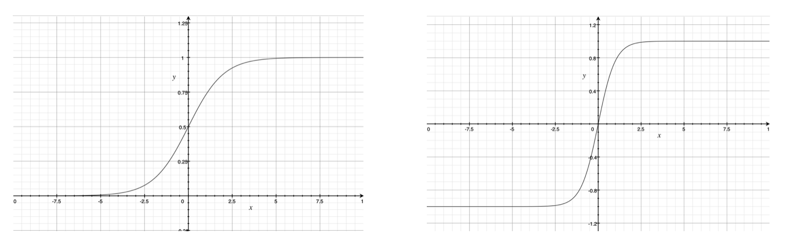
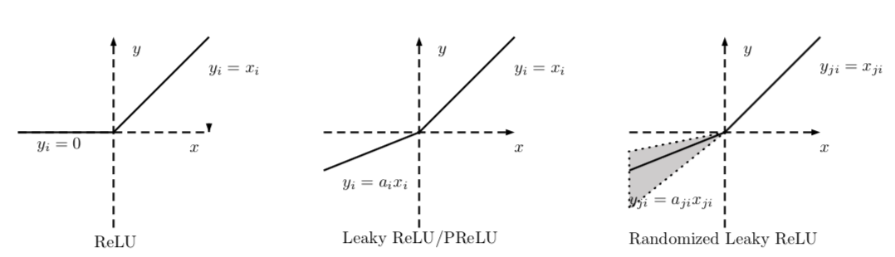

[TOC]

### 初始化

### 预处理

### 经典网络

### 激活函数

#### 1. 常见的激活函数及其导数

Sigmoid 激活函数的形式为   $$f(z) = \frac{1}{1+e^{-z}}$$,  对应的导函数为    $f'(z) = f(z)(1-f(z))$

Tanh激活函数的形式为   $f(z) = \frac{e^{z} - e^{-z}}{e^{z}+e^{-z}}$,    对应的导函数为$f'(z) = 1 - (f(z))^2$ 

ReLU 激活函数的形式为  $f(z) = max(0, z)​$,    对应的导函数为   $$f'(z)=\left\{
\begin{aligned}
1, z > 0 \\
0, z \leq 0 \\
\end{aligned}
\right.​$$

#### 2. 为什么 sigmoid 有何 tanh 激活函数会导致梯度消失的现象？

sigmoid 激活函数的曲线如下左图所示。它将输入z 映射到（0, 1），当z很大时， f(z) 趋近于1；当z很小时， f(z) 趋近于0， 而其导函数 $f'(z) = f(z)(1-f(z)) $ 在 z 很大或者很小时都会趋近于0，造成梯度消失的现象。

tanh 激活函数的图像如下右图所示。当z很大时，f(z) 趋近于1， 当z 很小时， z 趋近于-1。 其导数 $f'(z) = 1 - (f(z))^2$  在 z 很大或很小时都会趋近于0，同样会出现梯度消失。

​    实际上，Tanh 相当于 Sigmoid的平移：  $$tanh(z) = 2sigmoid(2x)-1$$。

#### 3. ReLU 系列的激活函数相对于 sigmoid 和 tanh 激活函数的优点是什么？它们有什么局限性以及如何改进？

优点：

（1）从计算角度上， Sigmoid 和 tanh 激活函数均需要计算指数，复杂度高，而ReLU只需要一个阈值即可得到激活值。

（2）ReLU 的非线性包含线性可以有效地解决梯度消失问题，提供相对较宽的激活边界。

（3）ReLU的单侧抑制提供了网络的稀疏表达能力。  

局限性：在训练过程中会会导致神经元死亡的问题。这是由于 $f(z) = max(0, z)$  导致负梯度在经过该ReLU 单元时被置为0， 且在之后也不被任何数据激活，即流经该神经元的梯度永远为0， 不对任何数据产生响应。在实际训练中，如果学习率设置较大，会导致超过一定比例的神经元不可逆死亡，进而参数梯度无法更新，整个训练过程失败。

一些ReLU 的改进措施：

（1）Leaky ReLU（LReLU）

Leaky ReLU 的表示形式为：$$f(z)=\left\{
\begin{aligned}
z, z > 0 \\
\alpha z, z \leq 0 \\
\end{aligned}
\right.$$ ， Leaky ReLU 与 ReLU 的区别在于当 $z\le 0$ 时， 其值不为零，一般来说a 为一个很小的常数(0.01或者0.001数量级的较小整数)，这样既实现了单侧抑制，又保留了部分负梯度信息以致不完全丢失。但另一方面，$ \alpha$  为超参数，较难设置为合适的值，且较为敏感，因此Leaky ReLU 函数在实际使用中的性能部分十分稳定。

（2）参数化 ReLU（Parametric  ReLU，PReLU）：PReLU将负轴部分斜率$ \alpha$ 作为网络中的一个可学习的参数融入模型的整体训练过程。有几点有趣的现象需要注意：

- 自由度较大的各通道独享参数的参数化ReLU性能相比较各通道共享参数更优。

- 在独享参数设定下学到的$ \alpha$取值呈现出由浅层到深层依次递减的趋势，这说明实际上网络所需要的非线性随着网络层数的增加而递减。 

  在分类精度上， 使用PReLU 作为激活函数的网络要优于原始ReLU的网络。但是PReLU在带来更大自由度的同时，也增加了网络模型过拟合的奉献，在实际使用中需要格外注意。

（3）随机化ReLU(Random ReLU, RReLU）：增加了“随机化机制， 其取值在训练阶段服从均匀分布，在测试阶段则将其指定为该均匀分布对应的数学期望 $ \frac{l+u}{2}\ $。

（4）指数化线性单元（Exponential Linear Unit， ELU）：2016年 Clevert 等人提出了指数化线性单元 ELU，其公式为： $$ELU(x)=\left\{
\begin{aligned}
x, x \ge 0 \\
\lambda \cdot (e^x - 1), z \lt 0 \\
\end{aligned}
\right.​$$。ReLU 具备了 ReLU 函数的优点，同时也解决了ReLU 函数自身的“死区”问题。不过ELU 函数中的指数操作稍稍增大了计算量。在实际应用中，ELU 中的超参数 $\lambda​$ 一般被设置为1。

#### 4. 如何选择激活函数 ?

使用激活函数是为了引入非线性从而产生强大的表达能力。关于激活函数的选择：首先使用最常用的ReLU 激活函数，但是需要注意模型参数的初始化操作和学习率的设置。为了进一步提高模型精度，可以尝试使用 Leaky ReLU、参数化ReLU、随机化ReLU 和 ELU。但是四者的实际性能优劣并无一致性结论，需要具体问题具体分析。

### 数据扩充

**数据扩充**，即根据一些先验知识，在保证特定信息的前提下，对原始数据进行适当变换，以达到扩充数据集的效果。有效的数据扩充，不仅能够扩充训练数据集，还能增加数据多样性。一方面能够避免过拟合，另一方面，又会带来性能的提升。具体到图像分类任务，在保持图像类别不变的前提下，可以对训练集中的每幅图像进行以下变换：

#### 1. 简单的数据扩充方式

- 在一定程度内的随机旋转(将原图旋转一定角度)、平移、缩放（将分辨率变为原图的0.8、0.9、1.1、1.2、1.3 倍）、裁剪(一般使用0.8-0.9倍原图大小的正方形在原图的随机位置处扣取图像块)、填充、左右翻转等。
- **色彩抖动：**在**RGB颜色空间**对原有的RGB色彩分布进行轻微的扰动，也可以在**HSV 颜色空间**尝试改变原有的饱和度和明度。

#### 2. 特殊的数据扩充方式

- **Fancy PCA：**例如在图像的 $RGB$ 颜色空间进行主成分分析，得到三个主成分的特征向量 $p_1、p_2、p_3$ ，及其对应的特征值 $\lambda1$， $\lambda2$,  $\lambda3$, 然后在每个像素RGB 值上添加增量 $[p_1,p_2,p_3]\cdot[\alpha_1\lambda_1, \alpha_2\lambda_2, \alpha_3\lambda3]^{T}$ ,其中 $\alpha_1, \alpha_2, \alpha_3$ 是均值为0， 方差较小的高斯分布随机数。
- **监督式数据扩充**：首先根据原数据训练一个分类的初始模型。而后，根据该模型，对每张图生成的可指示图像区域与场景标记间的相关概率。最后根据此概率映射回原图选择较强相关的图像区域作为扣取的图像块。

- 除了直接在图像空间进行变换， 还可以先对图像进行特征提取， 然后在图像的**特征空间内进行变换**，利用一些通用的数据扩充或者上采样技术，例如 **SMOTE 算法**。
- 使用**生成模型**也可以合成一些新样本。例如当今非常流行的对抗生成网络。

​    在实践中，需要根据自身的任务特点选择合适的数据扩充方式，而不能一股脑的将所有的数据扩充方法都用到自己任务之中。

### 参考资料

1. CS231n
2. Xu B, Wang N, Chen T, Li M. Empirical Evaluation of Rectified Activations in Convolutional Network. arXiv. 2015;cs.LG.
3. 《百面机器学习》
4. 《解析深度学习 卷积神经网络原理与视觉实战》

