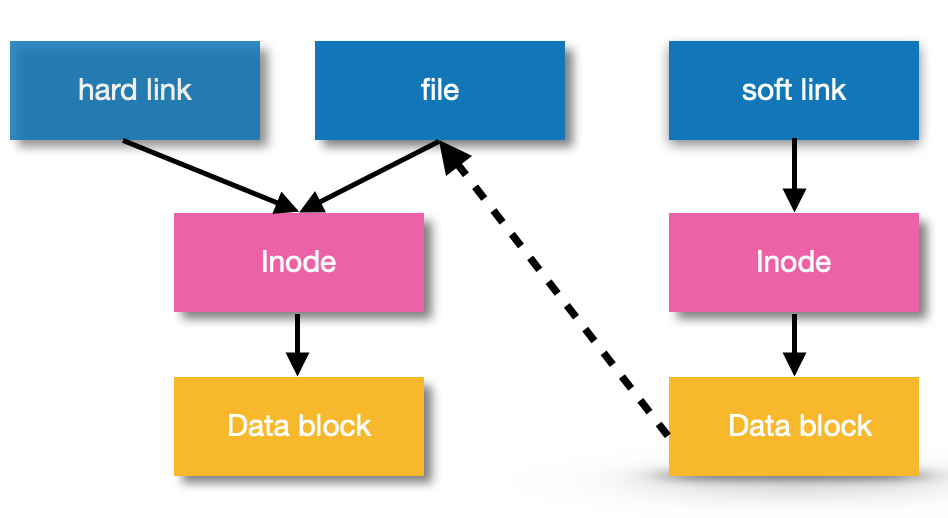
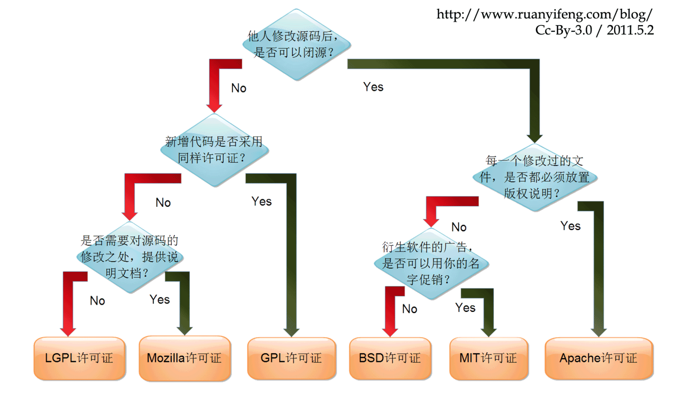

## Linux 基本知识：

#### 1. GNU vs BSD

##### 典型的类 unix 操作系统包括两个版本：

-  BSD 版本（ BSDs & Mac OS）
- GNU 版本（Linux）

##### Linux内核 vs 发行版
​        linux内核是一种开放源码的操作系统，提供硬件抽象层、硬盘及文件系统控制及多任务功能的系统核心程序。
​        linux发行版基于linux内核源码，将Linux系统的内核与外围实用程序、软件和文档包装起来，并提供一些系统安装界面和系统配置、设定与管理工具，就构成了一种发行版本(distribution)。

各种发行版可以主要分为两大系统：

- 以 RPM 方式安装软件的系统，包括Red Hat， Fedora， SuSE 等。
- 以 Debian 的 dpkg方式安装的软件的系统，包括 Debian， Ubuntu，B2D 等。

#### 2. 文件的目录

```shell
/              根目录
├── bin     存放用户二进制文件  # 
├── boot    存放内核引导配置文件  #
├── dev     存放设备文件  # 
├── etc     存放系统配置文件  # 
├── home    用户主目录  # 
├── lib     动态共享库
├── lost+found  文件系统恢复时的恢复文件
├── media   可卸载存储介质挂载点
├── mnt     文件系统临时挂载点  # 
├── opt     附加的应用程序包
├── proc    系统内存的映射目录，提供内核与进程信息  # 
├── root    root 用户主目录  #
├── sbin    存放系统二进制文件  # 
├── srv     存放服务相关数据
├── sys     sys 虚拟文件系统挂载点
├── tmp     存放临时文件
├── usr     存放用户应用程序
└── var     存放邮件、系统日志等变化文件   # 
```

#### 3. 软连接和硬链接

##### 硬链接

硬链接就是同一个文件使用了多个别名，他们有共同的 inode和 data block块。硬链接可由命令 `ln` 创建硬链接：

```
ln oldfile newfile
```

- 只能对已存在的文件进行创建；不能对目录进行创建，只可对文件创建；
- 删除一个硬链接文件并不影响其他有相同 inode 号的文件。

##### 软链接

软链接就是一个普通文件，只是数据块内容是另一文件的路径名的指向。软链接有着自己的 inode 号以及用户数据块。可以使用`ln -s` 创建软链接：

~~~shell
ln -s oldfile newfile 
~~~

- 软链接有自己的文件属性及权限等；
- 可对不存在的文件或目录创建软链接；软链接可对文件或目录创建；
- 创建软链接时，链接计数 **i_nlink** 不会增加；
- 删除软链接并不影响被指向的文件，但若被指向的原文件被删除，则相关软连接被称为死链接（即 **dangling link**，若被指向路径文件被重新创建，死链接可恢复为正常的软链接）。



#### 4. 环境变量

查看环境变量：`echo $PATH`

 将指定路径到系统路径(一次性)： `export PATH=$PATH:/path/to/dir `  

将指定路径到系统路径(长期)：

```shell
vim ~/.bashrc
export PATH=$PATH:/path/to/dir
source ~/.bashrc
```

#### 5. 常见的开源许可证选择



[参考资料]

1. https://www.ibm.com/developerworks/cn/linux/l-cn-hardandsymb-links/

