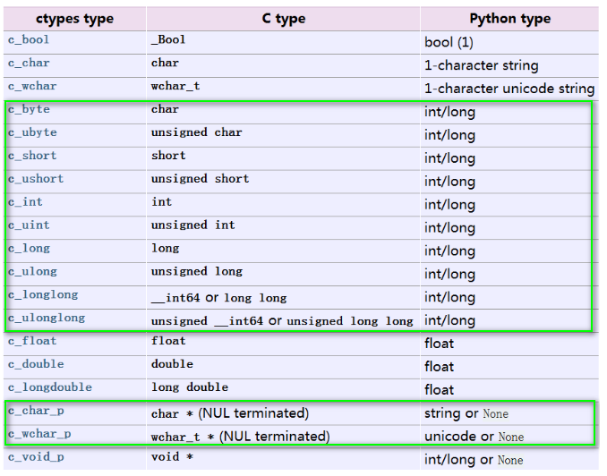

## Python 调用 C++ 之 ctypes

**ctypes** 官方网址: 　https://docs.python.org/zh-cn/3/library/ctypes.html#

基本的调用方法:

#### 1. 基本用法

在cpp文件中进行基本的实现

~~~cpp
// ．．．
~~~

h 文件提供接口，需要注意这里牵扯到调用cpp文件需要使用如下进行包装，否则python无法发现函数:

~~~cpp
#ifdef __cplusplus 
extern "C" { 
#endif
extern float func_name(int height, int width, uchar*img);
#ifdef __cplusplus 
} 
#endif
~~~

CMakeLists.txt 则是相关的编译文件:

~~~cmake
include_directories(include)
set(SRC_FILES hello.cpp)
add_library(mls SHARED ${SRC_FILES})
~~~

Python中的调用

~~~python
import ctypes

lib = ctypes.cdll.LoadLibrary("./build/libmls.so")
lib.func.restype = ctypes.c_float　　#　设置返回值类型

# 调用
res = lib.func(img.shape[0], img.shape[1]. img)
~~~

#### 2. 参数传递

###### （1） 简单的类型: int/float/Byte String

Python 中的类型， None，int， long， Byte String，Unicode String 作为 C 函数的参数默认提供转换外，其它类型都必须显式提供转换

###### （2）python list -> c++ vector

不仅仅需要传递相应的指针，还要传递长度，用来进行Ｃ++中的恢复工作．

Python部分:

~~~python
x1 = np.asarray([85, 101, 140, 326, 310, 273])
c_int_p = ctypes.POINTER(ctypes.c_int)

res = lib.func(x1.ctypes.data_as(c_int_p), len(x1))
~~~

C++部分:

~~~cpp
void func(int * x1, int n1){
　　　vector<int> res;
　　　for(int i = 0; i < n1*2; i+=2){　  //!! 传递整数，这里要乘以２, 现在仍然不知道为啥
	    res.push_back(x1[i]);
	}
}
~~~

###### （3）OpenCV mat

Python部分:

~~~python
img = cv2.imread('./00004.png')
img = np.asarray(img, dtype=np.uint8)
height, width = img.shape
img = img.ctypes.data_as(ctypes.c_char_p)  #　这里需要自己定义一下c指针

lib.mls_deformation(img.shape[0], img.shape[1], img)
~~~

C++部分：

~~~cpp
cv::Mat image(height, width, CV_8UC3);
uchar* pxvec =image.ptr<uchar>(0);
for(int row = 0; row < height; row++)
{
    pxvec = image.ptr<uchar>(row);
    for(int col = 0; col < width; col++)
    {
        for(int c = 0; c < 3; c++)
        {
            pxvec[col*3+c] = img[count];
            count++;
        }
    }
}
~~~

#### 3．返回值的处理

###### (1)　设定　return 类型

~~~cpp
using namespace cv;
#　两个函数均需要提供给cpp调用
uchar* cpp_canny(int height, int width, uchar* data) {
	cv::Mat src(height, width, CV_8UC1, data);
	cv::Mat dst; 
	Canny(src, dst, 100, 200);

	uchar* buffer = (uchar*)malloc(sizeof(uchar)*height*width);
	memcpy(buffer, dst.data, height*width);
	return buffer; //　实际测试这种情况下有一个 bug,　返回的图像没法reshape，　猜测为类型问题
}

#　这里如果不释放，　会导致内存泄露
void release(uchar* data) {
	free(data);
}
~~~

~~~python
from numpy.ctypeslib import ndpointer

frame_data = np.asarray(gray, dtype=np.uint8)
frame_data = frame_data.ctypes.data_as(ctypes.c_char_p)  
lib.cpp_canny.restype = ctypes.POINTER(ctypes.c_uint8) 　#　设定返回值类型
     
pointer = dll.cpp_canny(h, w, frame_data)  
np_canny =  np.array(np.fromiter(pointer, dtype=np.uint8, count=h*w)).reshape((h,w))

cv2.imshow('canny',np_canny)
cv2.waitKey(2000)

#　这里如果不释放，　会导致内存泄露
lib.release(ptr)
~~~

###### (2) inplace修改

传入一张空图片进行修改!

Python

~~~python
dst_data = np.zeros(img.shape, dtype=np.uint8)
c_int_p = ctypes.POINTER(ctypes.c_int)

lib.func(img.shape[0], img.shape[1], img, dst_data.ctypes.data_as(ctypes.c_char_p))

cv2.imshow("dst_data", dst_data)
cv2.waitKey(0)
~~~

C++

~~~cpp
＃ 将mat文件转化为指针
int count = 0;
uchar*  pxvec = curImg.ptr<uchar>(0);
for(int row = 0; row < height; row++)
{
    pxvec = curImg.ptr<uchar>(row);
    for(int col = 0; col < width; col++)
    {
        for(int c = 0; c < 3; c++)
        {
            dstImg[count] = pxvec[col*3+c];
            count++;
        }
    }
}
~~~

####　４．其他

（１）numpy库提供了ndpointer函数。ndpointer函数对restype和argtypes中的数组参数进行描述，他有如下4个参数：

- **dtype** :数组的元素类型
- **ndim** :数组的维数
- **shape** :数组的形状，各个轴的长度
- **flags** :数组的标志

（２） 如果cpp中用到了opencv， 那么通常需要将头文件和共享库(*.so)　进行打包，放到自己的项目下，　可以参照以下文件编写cmake

~~~cmake
cmake_minimum_required(VERSION 2.8)
project(demo)

include_directories(include)　#　opencv　头文件
#　共享库(*.so)
set(lib_files
   ${CMAKE_CURRENT_SOURCE_DIR}/lib/libopencv_highgui.so.3.4
   ${CMAKE_CURRENT_SOURCE_DIR}/lib/libopencv_videoio.so.3.4
   ${CMAKE_CURRENT_SOURCE_DIR}/lib/libopencv_imgcodecs.so.3.4
   ${CMAKE_CURRENT_SOURCE_DIR}/lib/libopencv_imgproc.so.3.4
   ${CMAKE_CURRENT_SOURCE_DIR}/lib/libopencv_core.so.3.4
)

file(GLOB_RECURSE SRC_FILES *.cpp) #源文件
add_library(mls SHARED ${SRC_FILES})
target_link_libraries(mls ${lib_files})   
~~~

