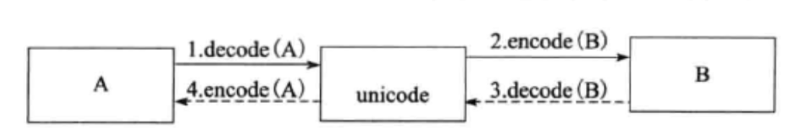

[TOC]

## Effective python : 编写高质量Python代码的59个有效方法

#### 建议 1 :  理解 Pythonic 概念

Pythonic 也许可以定义为：充分体现 Python 自身特色的代码风格。下面是一段经典的快速排序算法的Python 实现：

```python
def quicksort(array):
    less = []; greater = []
    if len(array) <= 1:
        return array
    pivot = array.pop()
    for x in array:
        if x <= pivot: less.append(x)
        else: greater.append(x)
    return quicksort(less) + (pivot) + quicksort(greater)
```

其充分体现了 Tim Peters 的《The Zen of Python》(Python 之禅)

~~~python
>>> import this
The Zen of Python, by Tim Peters

Beautiful is better than ugly.
Explicit is better than implicit.
Simple is better than complex.
Complex is better than complicated.
Flat is better than nested.
Sparse is better than dense.
Readability counts.
Special cases aren't special enough to break the rules.
Although practicality beats purity.
Errors should never pass silently.
Unless explicitly silenced.
In the face of ambiguity, refuse the temptation to guess.
There should be one-- and preferably only one --obvious way to do it.
Although that way may not be obvious at first unless you're Dutch.
Now is better than never.
Although never is often better than *right* now.
If the implementation is hard to explain, it's a bad idea.
If the implementation is easy to explain, it may be a good idea.
Namespaces are one honking great idea -- let's do more of those!
~~~

为了能够写出具有Pythonic 风格的 Python 代码，我们可以从如下几个方面入手：

##### （1）代码风格：

在语法上，代码风格要充分体现 Python 自身特色，比如以下代码：

```python
# 遍历一个容器
for i in list:  
    do_sth_with(i)

# 使用with 语句安全关闭文件描述符
with open(path, 'r') as f:    
    do_sth_with(f)

# 不应过分使用奇技淫巧   
a = [1, 2, 3, 4] 
c = 'abcdef'
print(list(reversed(a))) # rather than print(a[::-1])
print(list(reversed(c))) # rather than print(c[::-1])
```

##### （2）Python 标准库

写Python 程序需要对标准库有充分的理解，特别是内置的函数和内置数据类型，如下：

```Python
print('{great} from {language}'.format(great = 'Hello World', language = 'Python'))
# str.format()是 Python 最为推荐的字符串格式化方法
```

一个Pythonic 的框架不会对已经通过惯用法完成的东西重复发明“轮子”，而且它也遵循常用的Pyhon 惯例。Python 的包和模块结构日益规范化，现在的库和框架跟随了以下潮流：

- 包和模块的命名采用小写，单数形式，而且短小
- 包通常作为命名空间，如只包含空的__init\_\_.py 文件

### 编程惯用法

##### 利用 assert 语句来发现问题

断言，主要为调试程序服务，能够快速方便的检查程序的异常或者发现不恰当的输入。其基本语法为：

`assert expression1 ["," expression2]`

其中计算expression1 的值会返回 True 或者 False，当值为 False 的时候回引发 AssertionError，而expression2是可选的，常用来传递具体的异常信息。通常禁用断言的方法是在运行脚本的时候加上 `-O`标志。

需要注意的是不要乱用断言，断言应该用在正常逻辑不可到达的地方或者正常情况总是为真的场合，比如判断返回值是否合理或者当条件是业务逻辑继续的先决条件时可以使用断言。不要使用断言来进行异常处理和输入检查。

##### 数据交换时不推荐使用中间变量

```Python
x, y = y, x
# rather than:
# temp = a
# a = b
# b = temp
```

##### 充分利用 Lazy evaluation 特性

​    Lazy eavluation 通常被译为“惰性计算”或者“延迟计算”。指的是仅仅在真正需要的时候才计算出表达式的值。充分利用 Lazy evaluation 的特性带来的好处主要体现在以下两个方面：

​        避免不必要的计算，带来性能上的提升。*对于Python 中的条件表达式 `if x and y`, 在 x 为 `false` 的情况下，y 表达式的值将不再计算。而对于 `if x or y`,当 x 的值为 `true`的时候将直接返回，不再计算y 的值。编程中应当充分利用该特性。*

```Python
abbreviation = ['cf.', 'e.g.', 'ex.', 'etc.', 'fig.', 'i.e.', 'Mr.', 'vs.']
for i in xrange(1000000):
    for w in ['Mr.', 'Hat', 'is', 'ex.', 'etc.', 'chasing', 'the', 'black', 'cat', '.']:
        if w[-1] == '.' and w in abbreviations:
        # if w in abbreviations:
            pass
```

​        节省空间，使得无限循环的数据变成可能。*Python 中最典型的使用延迟计算的例子应该就是生成器表达式了，它仅仅在每次需要计算的时候才通过`yield` 产生需要的元素。*

```Python
# 生成斐波那契数列
def fib(n):
    a, b = 1, 1
    if a < n:
        yield a
    a, b = b, a + b
```

##### 枚举

​    在Python 3.4 之前并不提供枚举类型，我们可以使用第三方模块 `flufl.enum`， 它包含两种枚举类型：一种是 `Enum`， 只要保证枚举值唯一即可，对值的类型没有限制；还有一种是 `IntEnum`，其枚举值为 int 类型。

```Python
from flufl.enum import Enum
class Sessons(Enum):  # 继承自 Enum 定义 枚举
    Spring = "Spring"
    Summer = 2
    Autumn = 3
    Winter = 4
for member in Seasons.__members__:     # 对枚举名称进行迭代
    print(meber)
print(Seasons.Summer.value)  # 使用 value 属性获取枚举元素的值
```

##### 类型检查

不推荐使用 `type` 来进行变量的类型检查是因为基于内建类型扩展的自定义用户类型，type 并不能返回准确结果，而且在古典类中，所有的实例的 type 值都相等。如果需要约束用户的输入类型从而使之与我们期望的类型一致，通常的做法是：*如果类型有对应的工厂函数，可以使用工厂函数对类型做相应变换，否则可以使用`isinstance()`函数来检测, 其函数原型为: `isinstance(object, classinfo)`。*

```python
>>> isinstance(2, float)
False
>>> isstance("a", (str, unicode)) 
True
>>> isinstance((2, 3), (str, list, tuple)) # 支持多种类型列表
```

##### 尽量转换为浮点数之后再做除法

当除法运算中两个操作数都为整数的时候，其返回值也是整数，运算结果将直接阶段，从而在实际应用中产生误差。所以当设计除法运算的时候尽量先将操作数转换为浮点类型再做运算。

```Python
gpa = float((4*96+3*85+5*98+2*70)*4)/ float((4+4+5+2)*100)
# rather than:
# gpa = ((4*96+3*85+5*98+2*70)*4)/ ((4+4+5+2)*100)
```

浮点数的存储规则决定了不是所有的浮点数都能准确表示，有些是不准确的，只能无限接近。如果计算对精度要求比较高， 可以使用Decimal 来进行处理或者将浮点数扩大为整数，计算完毕后再转换回去。

##### 警惕 eval() 的安全漏洞

Python 中的 eval() 函数将字符串 str 当成有效的表达式求值并返回结果。其函数声明为 `eval(expression[, globals[, locals]])`，其中参数 globals 为字典形式，locals为任何映射对象。需要注意的`eval()`函数存在安全性问题。如果对象不是信任源，应当尽量避免使用`eval()`, 在需要使用`eval()`的地方可以使用安全性更好的 `ast.literal_eval()`。

##### 使用 enumerate() 获取迭代的索引和值

​        对序列进行迭代并获取序列中的元素，推荐使用 enumerate()获取元素的索引和值。其函数签名为:`enumerate(sequence, start=0)`，函数返回本质上为一个迭代器。

```python
li = [a, b, c, d, e]
for i,e in enumerate(li):
    print("index:{0:}, element:{1:}".format(i,e))
```

对于字典的迭代循环，enumerate()函数并不适合，应该使用 iteritems() 方法

```Python
for k, v in personinfo.iteritems():
    print("{0:} : {1:}".format(k,v))
```

##### 分清楚 == 与 is 的适用场景

`is` 表示的是对象标示符(object identity), 其作用是减产对象的标示符是否一致的，也就是两个对象在内存中是否拥有同一块存储空间。`a is b` 基本相当于 `id(x) == id(y)`。而 `== `表示的意思是相等(equal)，用来检验两个对象的值是否相等，它实际调用内部的\_\_eq\__() 方法。需要注意一点的是，对于较小的字符串，为了提高系统性能会保留其值的一个副本，当创建新的字符串时直接指向该副本即可，也就是说其id 是一致的。

##### 考虑兼容性，尽可能的使用 Unicode 编码

对于A、B 两种编码系统，两者之间的相互转换如下所示,当对字符串进行编码转化时，需要以原有的编码方式进行解码，然后以我们需要的方式进行编码。



​    对于中文字符，为了做到不同系统之间的兼容，建议直接采用 Unicode 编码，在文件头中加入如下编码声明:

```python
#!/usr/bin/python
# -*- coding:utf-8 -*-
```

​    执行如下命令会报错，这是因为Python 会将左侧的中文字符串转换为 Unicode 编码，str 转化时会使用系统默认的ASCII 编码对字符串进行解码，因此我们需要制定解码方式：

```Python
#-*- coding:utf-8 -*-
s = "中文测试" + u'Chinese Test' 
# Solution：s = "中文测试".decode("gbk") + u'Chinese Test'
print(s)
```

##### 构建合理的包层次来管理 module

​        本质上每一个 Python 文件都是一个模块，我们通过包(Package) 来合理的组织项目的层次来管理模块。包即是目录，但是与普通目录不同的是，它除了包含常规的 P樱桃红文件以外，还包含一个 __init\_\_.py 文件，同时允许嵌套。包的结构如下：

```Shell
Package/ __init__.py
  Moudle1.PY
  Moudle2.py
  Subpackage/__init__.py
      Moudle1.py
      Moudle2.py      
```

导入方式：

```python
from Package import Moudle1
import Pachage.Moudle1

from Package import Subpackage
import Package.Subpackage

from Package.Subpackage import Moudle1
import Package.Subpackage.Moudle
```

以下是一个仅提供参考的Python 项目文件结构：

```shell
ProjectName/
|--READER
   |-- license
   |-- SETUP.PY
   |-- REQUIRMENTS.TXT
   |-- SAMPLE/
   |   |-- __init__.py
   |   |-- core.py
   |   |-- helpers.py
   |-- docs/
   |   |-- conf.py
   |   |-- index.rst
   |-- bin
   |-- package/
   |   |-- __init__.py
   |   |-- subpackage
   |   |-- ......
   |-- test/
   |   |-- test_basic.py
   |   |-- test_advanced.py
```


#### 建议 21  i+= 1 不等于 ++i

Python 会将 `++i` 操作解释为 `+(+i)` ，其中`+` 表示正数符号。对于`--i` 操作也是类似。

```Python
>>> 2
2
>>> --2
2
>>> 2
2
>>> ++2
2
>>> -----2
-2
>>> 
```

#### 建议 22 使用with 自动关闭资源


#### 建议 27 连接字符串应优先使用join 而不是 +

使用 join 连接字符串的方法如下：

```python
>>> str1, str2, str3 = 'testing', 'string', 'concatenation'
>>> ' '.join([str1, str2, str3])
'testing string concatenation'
```

使用 join() 方法 和使用 + 操作符来连接字符串，join() 方法的效率要明显的高于 + 操作符。这是因为执行`+` 操作会在内存中申请一块新的内存空间，并将本次操作的左操作数和右操作数复制到新申请的内存地址。因此在N个字符串连接的过程中，会产生N-1个中间结果，每产生一个中间结果都需要申请和复制一次内存，总共需要申请N-1次内存，字符串的连接时间约为 s * n^2 ， 从而严重的影响效率。而但使用join() 方法连接字符串的时候，会首先计算需要申请的总的内存空间，然后一次性申请所需内存，并将字符序列中的每一个元素复制到内存中去，所以join操作的时间约为s*n，其中s为复制一次字符串的平均时间。