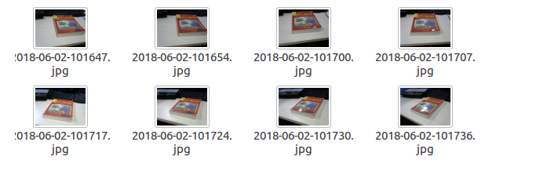
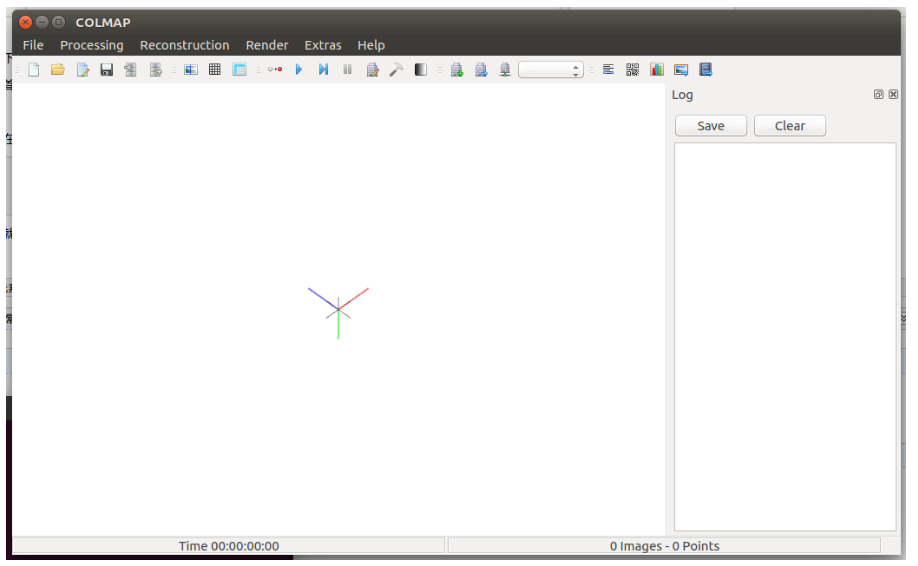
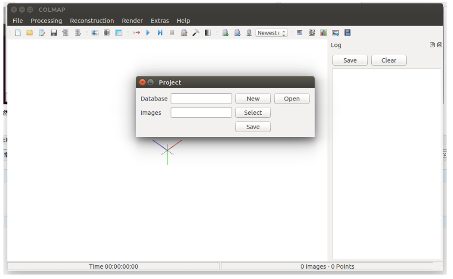
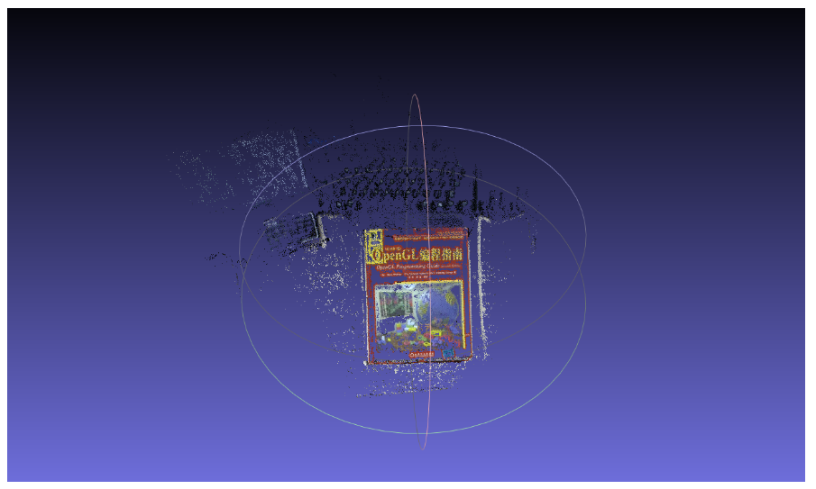

## 使用　Colmap　进行稠密重建

colmap应该是目前state-of-art的增量式SFM方案，可以方便的对一系列二维图片进行三维重建

不用对摄像机进行标定，只需要从不同角度对重建场景或物体进行拍摄得到一系列图像作为输入

#### 安装方法

 <https://colmap.github.io/install.html>

#### 使用

下面就是如何使用colmap来跑自己的数据进行三维重建

首先从不同角度对重建物体进行拍摄，我选取了8张图片

（１）在终端运行如下命令，就可以打开colmap的可视化界面

~~~
colmap -h　#　帮助
colmap gui　#　启动GUI
~~~

（２）然后点击file菜单，新建工程，并选取数据文件夹，

（３）点击菜单Reconstruction,选择start Reconstruction就可以自动进行重建，得到稀疏点云模型， 接下来可以进一步进行稠密重建，保存为ply点云模式, 得到如下点云模型

 详细的可以参考youtu上的视频   https://www.youtube.com/watch?v=bDHJM6nAKtc

 colmap的官方网站:https://demuc.de/colmap/