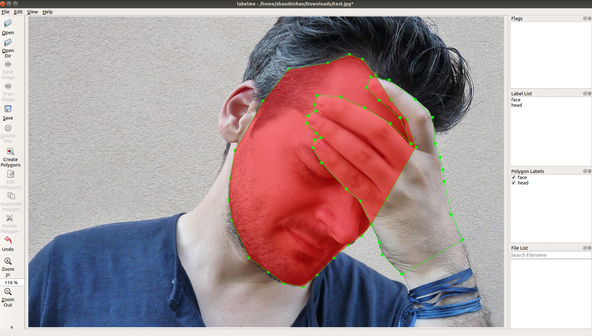
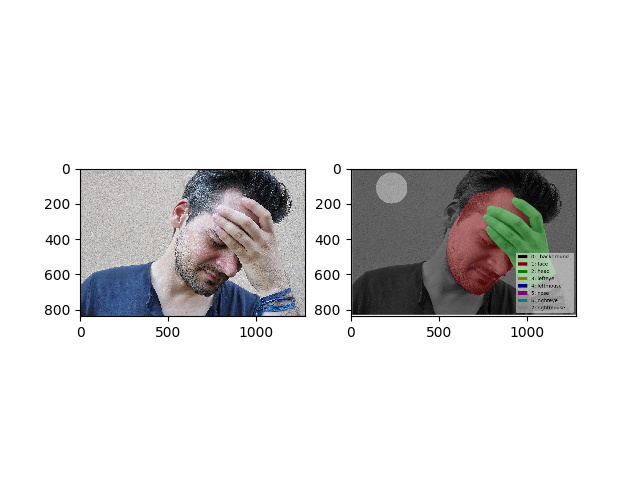
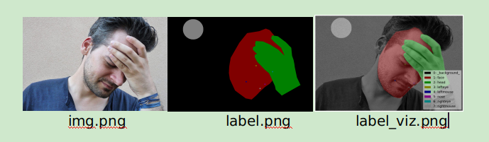

## Labelme 简单使用

图像语义分割是一种 pixel-wise 级的一种图像分类操作，其目的是在图像中上的同一个类别上打上相同的label，以表示这个类别是同一类。 在训练自己的数据集中，语义分割最重要且最基础的一步便是对图像进行标注，以训练得到自己的模型。 在标注图像中， 推荐一个python版的labelme，链接： 
https://github.com/wkentaro/labelme

#### 1. installs

~~~
sudo apt-get install python-pyqt5
sudo pip install labelme
~~~

#### 2. 使用 Usage

（1）启动

​    直接在 命令行输入 `labelme` 即可启动。界面如下所示：

 可以用 Edit 来选择相应的标注类型：

- Polygon 用来创建分割实例， 使用多边形进行标注。

- Rectangle 用来创建 矩形框(bbox)， 用来进行标注检测实例。
- Point 则是用来标注 landmark 样本
- Line 直线
- Circle 是 圆

（2）  标记完成后点击 save 会生成相应的 json 文件。查看标记文件可以执行命令：

~~~
labelme_draw_json test.json
~~~

(3) 将 对应的 json 文件转换为单通道的image， 可以执行如下命令：

~~~
labelme_json_to_dataset test.json
~~~

这样会生成一个和json文件同名的文件夹。里面有 img.png  info.yaml  label_names.txt  label.png  label_viz.png五个文件。  其中label.png即是我们要的单通道图片。

（4）批量转换的话，就需要自己写shell 脚本会方便一些。脚本也是极其简单的：

~~~
#python2 file 

import os
json_dir_path = './json'  
for file in os.listdir(json_dir_path):
    os.system("labelme_json_to_dataset {0:}".format(os.path.join(json_dir_path, file)))
    # rename label img
    # raw_name = file.split('.')[0] 
    # img_name = raw_name + "_gt.png"
    # src_path = os.path.join(json_dir_path, raw_name + "_json","label.png")
    # dst_path = os.path.join(json_dir_path, raw_name + "_json", img_name)
    # os.system("mv {0:} {1:}".format(src_path, dst_path))

# cp 
# os.system("cp ./json/*/bad*_gt.png ./gt")
~~~

