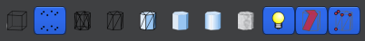
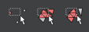
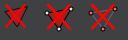

### Mesh Lab学习

###### (1) MeshLab

**MeshLab**是来自国外的一款开源、可移植和可扩展的三维几何处理系统，主要用于处理和编辑3D三角网格，它提供了一组用于编辑、清理、修复、检查、渲染、纹理化和转换网格的工具。提供了处理由3D数字化工具/设备生成的原始数据以及3D打印功能。帮助在 3D 扫描、 编辑、 清洗、 愈合、 检查、 呈现和转换这种网格提供一套工具。

版本查看　help ->　about -> MeshLab v1.3.2

###### (2) 载入三维模型：

这里以 Stanford_bunny 为例  

standord bunny主页:　http://graphics.stanford.edu/data/3Dscanrep/

stanford bunny wiki: <https://en.wikipedia.org/wiki/Stanford_bunny>) 

点击 File ->  Import Mesh 可以载入各种格式的三维模型，包括 `obj`,`ply`,`stl`,`off` 等知名的三维模型文件，但是除了dxf的3DFace文件。 可以用以下图标来控制显示的方式：

- 界面下方参数含义
  **FOV** :  (Filed of view) 摄像机视野                  **FPS** : (Frames per second)每秒传输帧数
  **MESH** : 导入模型名                                         **Vertices** : 模型点数
  **Faces** : 模型面数

- MeshLab支持的文件格式：

  STL,OFF,**OBJ**,**PLY**,PTX,V3D,PTS,APTS,**XYZ**,GTS,TRI,ASC,X3D,X3DV,VRML,ALN

  pcd格式：点云数据格式

  ply格式：Stanford大学开发的一套三维mesh模型数据格式，该格式主要用以储存立体扫描结果的三维数值，透过多边形片面的集合描述三维物体。

  obj格式：OBJ文件是由　Alias|Wavefront公司推出的一种标准的3D模型文件格式，很适合用于3D软件模型之间的互导。

###### （３）增密（平滑）网格或者是稀疏（简化）网格

如果你需要大量的三维点云数据集，那么你可以对载入的三维网格模型进行平滑加密，那么你就可以获得更多的三维点；相反，如果你的机器内存不足，不足以处理大数据量的点云，你可以选择对载入的三维网格模型进行简化，那么自然，点的数量也会跟着减少。

**平滑网络**：

Filters -> Remeshing, Simplification and Reconstruction －>

其中的 Subdivision Surfaces:　Butterfly subdivision、Subdivision Surfaces:　Catmull-Clark、Subdivision Surfaces:　LS3　Loop 、Subdivision Surfaces:　Loop、Subdivision Surfaces:　Midpoint可以任选一个。进行网格细分，增加三角形，间接增加点的数量 。

**稀疏网络:**：

Filters -> Remeshing, Simplification and Reconstruction -> Quadric Edge Collapse Decimation 

Filters -> Remeshing, Simplification and Reconstruction -> Quadric Edge Collapse Decimation (with texture)
可以选择上图中的任意的算法进行网格简化，减少三角形，间接减少点的数量

######　（４）简单编辑（删除）

通过以下图标对点进行选中：

然后通过如下图标对点云进行删除：

###### （５）导出

File -> Export Mesh as ->　选择格式和保存路径　－>　Save　即可。

###### (6)每一个按钮的具体讲解：

 https://blog.csdn.net/qq_15262755/article/details/80352867

###### (7) obj 文件

在这个列表中, 关键字根据数据类型排列，每个关键字有一段简短描述。

顶点数据　(Vertex data)：

**v** 几何体顶点 (Geometric vertices)：　x、y、z、r、g、b

**vt** 贴图坐标点 (Texture vertices)：

**vn** 顶点法线 (Vertex normals)：

cstype 曲线或表面类型 (Curve or surface type)

**f** 面 (Face)： v1、v2、v3

第一种 obj为:

~~~shell
# v：x、y、z、r、g、b
# f：v1、v2、v3
~~~

第二种obj为：

~~~shell
v：x, y, z
f：v1/vt1/vn1、v2/vt2/vn2、v3/vt3/vn3
# f表示一个面，面使用1/2/8这样格式，表示顶点位置/纹理坐标/法向量的索引，这里索引的是前面用v,vt,vn定义的数据 注意这里Obj的索引是从1开始的，而不是0
vt：u, v, w
vn：vn_x, vn_y, vn_z
~~~

**需要重点理解一下这里的 vt和vn: **

**vt: **　绘制模型的三角面片时，每个顶点取像素点时对应的纹理图片上的坐标。纹理图片的坐标指的是，纹理图片如果被放在屏幕上显示时，以屏幕左下角为原点的坐标。
注意：w一般用于形容三维纹理，大部分是用不到的，基本都为0。
**vn: ** 绘制模型三角面片时，需要确定三角面片的朝向，整个面的朝向，是由构成每个面的顶点对应的顶点法向量的做矢量和决定的（xyz的坐标分别相加再除以3得到的）。

!!!! **单一的第二种格式的obj文件是没有颜色信息的，需要一个对应的图去索引，才能获取对应的颜色信息，形成一个有颜色的三维图**。
示例文件可以参见　本文件夹下面的obj_format2文件夹

参考资料：

（１）[OpenGL学习脚印:模型加载初步-加载obj模型(load obj model) ](https://blog.csdn.net/wangdingqiaoit/article/details/51879737)

（２）Stanford CS231a: http://web.stanford.edu/class/cs231a/

（３）MeshLab学习笔记：　https://blog.csdn.net/qq_40313712/article/details/86554480

（４）OPENGL tutorial http://www.opengl-tutorial.org/beginners-tutorials/tutorial-7-model-loading/

（５）3D中的obj文件格式：　https://www.cnblogs.com/slysky/p/4081307.html

（６）[简易教程：教你如何使用Meshlab提取已有的三维模型的结构点云](https://blog.csdn.net/HW140701/article/details/78876507)

（７）https://blog.csdn.net/xyh930929/article/details/82260581>

