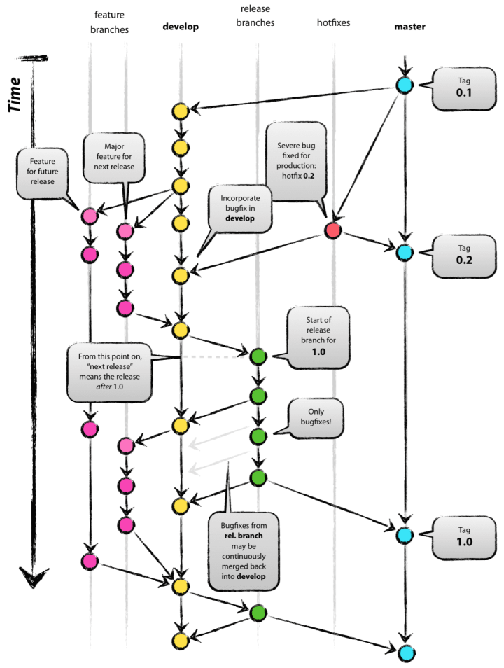

### 1. 安装和配置 [F]

~~~shell
sudo apt-get install git  # 安装 git
~~~

~~~shell
git config --global user.name "Your Name" # 设置用户名
git config --global user.email "email@example.com"  # 设置 email
#  --global 表示系统用户级别，保存于  ~/.gitconfig   
#  缺省则为项目级别/仓库级别， 保存于当前目录下的　.git/config
~~~

~~~shell
ssh-keygen -t rsa -b 4096 -C "your_email@domain.com" 
# 生成秘钥对， 公钥放git, 私钥放本地(一般放置在 ~/.ssh)
~~~

### 2. 基本用法

**Workspace**：工作区                                               **Index / Stage**：暂存区
**Repository**：仓库区（或本地仓库）                    **Remote**：远程仓库

~~~shell
git init  # 当前目录下会自动生成一个.git的目录，用来跟踪管理版本库
~~~

~~~shell
git add <filename> # 添加文件
git rm <filename>  # 删除文件   -r 删除文件夹

git commit -m "wrote a commit msg"  #　从暂存区提交到本地仓库
git rm --cached <filename>  # 舍弃暂存区内容

git push origin master #　从本地仓库推送到远程仓库

git clone /path/to/repository  # 创建一个远程仓库的本地克隆版本
git clone usename@host:/path/to/repository # 远程服务器上的仓库

git checkout -- <filename>  # 替换本地改动，　将仓库中的文件替换掉工作目录中的文件

git pull <远程主机名> <远程分支名>:<本地分支名> 　# 取回远程主机某个分支的更新，再与本地的指定分支合并
~~~

~~~shell
git status  # 显示工作目录和暂存区的状态（显示所在分支、工作区和暂存区的状态）
~~~

### 3. 版本回退和前进

~~~shell
git log # 查看提交历史(包括　ID, author, data等信息)  
＃　--pretty=oneline  一条日志只显示一行    --online 更加简洁的方式显示
git reflog # 显示版本移动步数 HEAD@{移动到当前版本需要的步数} 　　　-> HEAD是当前版本的指针

# 版本回退与前进
git reset --hard Index_value # 基于索引值 进行版本回退和前进
# --soft 仅仅在本地库移动 HEAD 指针  　　--mixed 在本地库移动 HEAD 指针， 并重置暂存区
# --hard 在本地库移动HEAD 指针，并重置暂存区和工作区

git rm filename  # 删除文件
git commit -m "delete a file"

git reset --hard HEAD # 舍弃工作区和暂存区的修改，直接用本地库替换

git diff filename # 默认比较的是工作区和暂存区
git diff [HEAD] filename # 比较工作区和本地库[HEAD]，可以通过修改[HEAD]与历史记录进行比较
~~~

### 4. 多人协作（分支管理）

其中涉及到的主要分支类型有：

- **master分支**，即主分支。任何项目都必须有个这个分支。**对项目进行tag或发布版本等操作，都必须在该分支上进行**。

  ~~~shell
  git tag v0.2　# 为当前分支打　tag
  git push --tags  # 将tag推送到远程仓库
  ~~~

- **develop分支**，即开发分支，**从master分支上检出**。**团队成员一般不会直接更改该分支，而是分别从该分支检出自己的feature分支，开发完成后将feature分支上的改动merge回develop分支**。**同时release分支由此分支检出**。

  ~~~shell
  git branch develop master    # 从master分支上新建develop分支
  git checkout develop    # 检出develop分支, 此处可进行功能开发，并add和commit到develop分支
  git push origin develop    # 推送develop分支到远端的origin/develop
  ~~~

- **release分支**，即发布分支，**从develop分支上检出,该分支用作发版前的测试，可进行简单的bug修复**。如果bug修复比较复杂，可merge回develop分支后由其他分支进行bug修复。此分支测试完成后，需要同时merge到master和develop分支上。

- **feature分支**，即功能分支，**从develop分支上检出。团队成员中每个人都维护一个自己的feature分支，并进行开发工作，开发完成后将此分支merge回develop分支**。此分支一般用来开发新功能或进行项目维护等。

  ~~~shell
  git clone /path/to/repository
  git checkout develop　# 检出 develop分支
  git checkout -b feature-hu develop    # 从develop分支新建并检出feature分支
  ... # 这里可以进行一些功能开发，并不断的add和commit
  git checkout develop    # 切换回develop分支
  git pull origin develop    # 更新远端代码，看develop分支是否有更新（无更新）
  git checkout feature-hu    # 切换回feature分支
  git rebase develop    # 合并develop分支到feature分支，并解决冲突（无冲突）
  
  git checkout develop    # 切换回develop分支
  git merge --no-ff feature-hu    # 合并feature分支到develop分支
  git push origin develop   # 推送develop分支到远端 
  ~~~

- **fix分支**，即补丁分支，**由develop分支检出，用作bug修复**，bug修复完成需merge回develop分支，并将其删除。所以该分支属于临时性分支。

- **hotfix分支**，即热补丁分支。和fix分支的区别在于，**该分支由master分支检出，进行线上版本的bug修复**，修复完成后merge回master分支，并merge到develop分支上，merge完成后也可以将其删除，也属于临时性分支。

  ~~~shell
  git checkout master    # 切换回master分支
  git checkout -b hotfix master    # 新建hotfix分支，并切换到该分支
  ......                 # 做一些bug修复工作
  git checkout master    # 切换回master分支
  git merge --no-ff hotfix    # 合并hotfix分支，此时bug已被修复（无冲突）
  
  git tag v0.2.1    # 新建tag v0.2
  git push origin master    # 推送master分支代码到远端
  git push origin --tags    # 推送tag到远端
  ~~~

如何解决冲突：

~~~shell
# 解决冲突
# step 1: 手动修改冲突文件
# step 2： git add filename
# step 3: git commit -m "commit message"
~~~

### 5. 远程操作

##### 团队内部协作：

~~~shell
git remote add origin https://xxxx.xxxx.xxxx.xxxx  # 指定 远程库的别名
git push -u 远程库名称 本地库名称
git clone https://xxxx.xxxx.xxxx.xxxx   # clone 到本地库

$ git fetch [远程地址别名][远程分支名]
$ git merge [远程地址别名/远程分支名]
~~~

##### 跨团队协作：

~~~shell
# TBD:
# (1) 跨团队写作
#（２）mooc
# (3) understand master & HEAD & origin
~~~

### 6. 安装 GitLab　[F]

~~~shell
# 安装
$ curl -sS http://packages.gitlab.com.cn/install/gitlab-ce/script.deb.sh | sudo bash
$ sudo apt-get install gitlab-ce

# 配置
$ gitlab-ctl reconfigure 

# 启动
$ gitlab-ctl start 

# 在浏览器输入对应的IP地址即可访问gitlab后台，可能需要关闭防火墙
# （1）对root用户设置密码
# （2）登陆：用户名默认为root  
# （3）在后台进行添加用户等操作、设置密码等操作
~~~

### 7. 其他 [F]

（1） 如何设置不被追踪的文件
     有些文件是不想被追踪的， 可以修改  `.git/info/exclude` 文件， 以 # 开头，添加规则即可。

（2）server certificate verification failed. CAfile:/etc/ssl/certs/ca-certificates.crt CRLfile: none

~~~shell
export GIT_SSL_NO_VERIFY=1
~~~

###　8. 参考资料 [F]

- git 简明指南  https://rogerdudler.github.io/git-guide/index.zh.html

- git-scm-zh: https://git-scm.com/book/zh/v2
- 常见　UI 界面: [SourceTree](https://www.sourcetreeapp.com/)      [tortoisegit](https://tortoisegit.org/)     [Tower](https://www.git-tower.com/mac)
- gitflow https://nvie.com/posts/a-successful-git-branching-model/
- gitflow 备忘清单 https://danielkummer.github.io/git-flow-cheatsheet/index.zh_CN.html

- 互动式学习git的网站：　https://learngitbranching.js.org/
- 图解git:  https://my.oschina.net/xdev/blog/114383
- git magic: http://www-cs-students.stanford.edu/~blynn/gitmagic/intl/zh_cn/index.html
- github help: https://help.github.com/en
- 本地搭建Git： [GitLab](<https://about.gitlab.com/>) 和　[dashboard](https://github.com/gogs/gogs)
- [图文详解如何利用Git+Github进行团队协作开发](https://zhuanlan.zhihu.com/p/23478654)